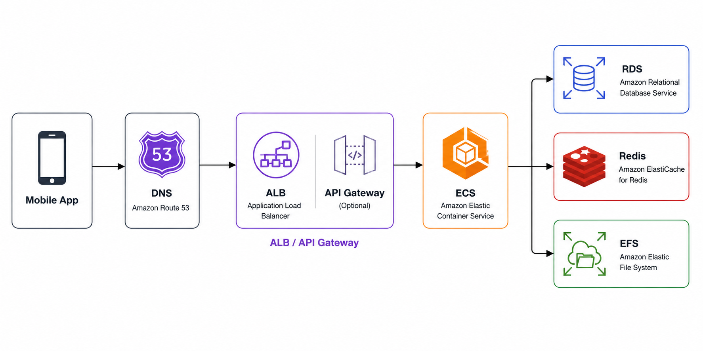

# M1: Mobile App to AWS Backend Flow



High-level flow:

```text
Mobile app -> DNS -> ALB/API Gateway -> ECS -> RDS/Redis/EFS
```

This is a common request path when a mobile app calls a backend API running on AWS. The request starts from the app, resolves the API domain through DNS, enters the traffic layer, reaches the backend service, and then the backend reads from or writes to a database, cache, or file system.

## Main Modules

### Mobile App

The mobile app is the application running on the user's phone. When the user logs in, opens a screen, taps a button, or submits a form, the app sends an API request over the internet.

Example:

```text
GET https://api.example.com/users/me
```

### DNS

DNS is the system that maps a domain name to the real network target.

Example domain:

```text
api.example.com
```

DNS points this domain to the place that receives traffic, usually an ALB, API Gateway, or CloudFront distribution. On AWS, the common DNS service is Amazon Route 53.

Key idea: the app does not need to remember the backend IP address. It calls a domain name, and DNS helps find the correct target.

### ALB

ALB means Application Load Balancer. It receives HTTP/HTTPS requests and distributes traffic to backend services.

ALB is commonly used when the backend runs on ECS, EC2, or Kubernetes. It can:

- Receive requests from the internet.
- Run health checks against backend targets.
- Spread traffic across multiple tasks or containers.
- Route by path, such as `/api`, `/admin`, or `/health`.

### API Gateway

API Gateway is an entry point for APIs. In this flow, API Gateway is optional.

API Gateway is useful when you need:

- Clear API management.
- Rate limiting.
- Authentication or authorization.
- Request/response mapping.
- Integration with Lambda or other AWS services.

For a simple ECS backend, ALB is often enough. If you need stronger API-level control, you can put API Gateway in front.

### ECS

ECS means Amazon Elastic Container Service. It runs backend applications as containers.

For example, a backend written in Node.js, Java, Go, or Python can be packaged as a Docker image and then run as an ECS task.

ECS is responsible for:

- Running containers.
- Restarting containers when they fail.
- Scaling the number of tasks.
- Connecting with ALB to receive requests.

### RDS

RDS means Amazon Relational Database Service. It is a managed relational database service from AWS.

Examples:

- PostgreSQL
- MySQL
- MariaDB

A backend running in ECS often uses RDS to store core application data, such as users, orders, payments, or products.

Key idea: RDS stores structured data that must be durable and reliable.

### Redis

On AWS, Redis is commonly provided by Amazon ElastiCache for Redis.

Redis is a cache or in-memory data store. It is usually used for data that needs very fast access.

Examples:

- Login sessions.
- Cached query results.
- Rate limit counters.
- Simple queue or job state.

Key idea: Redis is faster than a database, but it usually does not replace the main database.

### EFS

EFS means Amazon Elastic File System. It is a shared file system that can be mounted by multiple ECS tasks.

EFS is useful when the application needs to read or write files using a normal folder/file structure.

Examples:

- Temporary uploaded files.
- Shared config or files across containers.
- Data that multiple tasks need to access together.

Key idea: EFS works like a shared network drive for services.

## Request Flow Summary

1. The user takes an action in the mobile app.
2. The mobile app calls an API domain, such as `api.example.com`.
3. DNS resolves the domain to ALB or API Gateway.
4. ALB/API Gateway receives the request and forwards it to ECS.
5. ECS runs the backend container that handles the business logic.
6. If the backend needs data, it talks to RDS, Redis, or EFS.
7. The response travels back to the mobile app.

## Quick Memory Table

| Module | Short role |
| --- | --- |
| Mobile App | Where the user sends the request |
| DNS | Maps domain name to target |
| ALB | Distributes traffic to backend |
| API Gateway | Managed API entry point, optional |
| ECS | Runs backend containers |
| RDS | Stores the main database |
| Redis | Caches fast-access data |
| EFS | Provides shared file storage |

