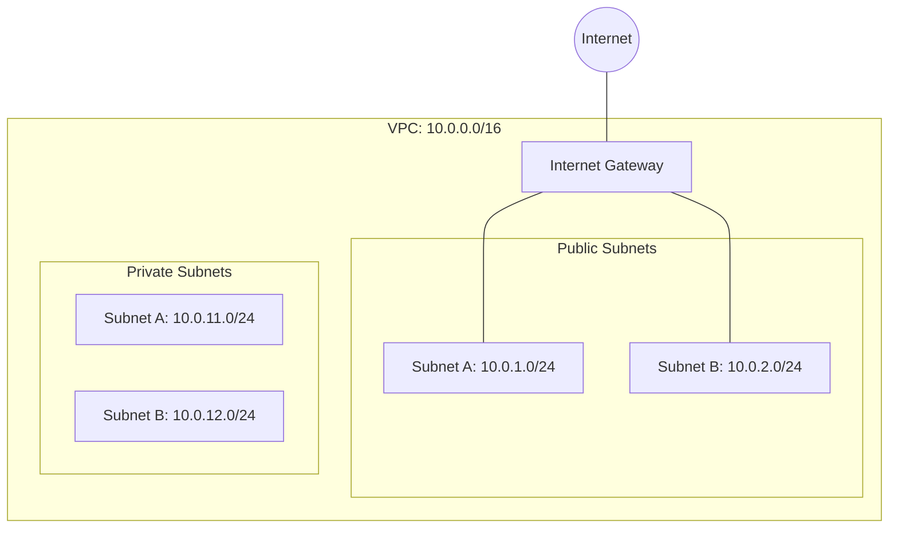

# Step 1: VPC and Networking Foundation

Welcome to the step-by-step guide for deploying our CloudFormation stack. In this first step, we will create the core networking infrastructure: a Virtual Private Cloud (VPC), Subnets (Public and Private), an Internet Gateway, and Route Tables.

## The Architecture



## Creating the Template

1. Inside the `cloudformation/stack` directory, create a new file named `demo-stack.yml`.
2. Add the following YAML code to define our parameters and networking resources:

```yaml
AWSTemplateFormatVersion: '2010-09-09'
Description: 'Step 01 - VPC and Networking'

Parameters:
  DemoPrefix:
    Type: String
    Default: learn-devops-demo
    Description: Prefix for all resource names

Resources:
  # ─────────────────────────────────────────────────────────────────────
  # VPC + Internet Gateway
  # ─────────────────────────────────────────────────────────────────────
  DemoVpc:
    Type: AWS::EC2::VPC
    Properties:
      CidrBlock: 10.0.0.0/16
      EnableDnsSupport: true
      EnableDnsHostnames: true
      Tags:
        - Key: Name
          Value:
            Fn::Sub: "${DemoPrefix}-vpc"

  InternetGateway:
    Type: AWS::EC2::InternetGateway
    Properties:
      Tags:
        - Key: Name
          Value:
            Fn::Sub: "${DemoPrefix}-igw"

  VpcGatewayAttachment:
    Type: AWS::EC2::VPCGatewayAttachment
    Properties:
      VpcId:
        Ref: DemoVpc
      InternetGatewayId:
        Ref: InternetGateway

  # ─────────────────────────────────────────────────────────────────────
  # Public Subnets
  # ─────────────────────────────────────────────────────────────────────
  PublicSubnetA:
    Type: AWS::EC2::Subnet
    Properties:
      VpcId:
        Ref: DemoVpc
      CidrBlock: 10.0.1.0/24
      AvailabilityZone:
        Fn::Select:
          - 0
          - Fn::GetAZs: ''
      MapPublicIpOnLaunch: true
      Tags:
        - Key: Name
          Value:
            Fn::Sub: "${DemoPrefix}-public-a"

  PublicSubnetB:
    Type: AWS::EC2::Subnet
    Properties:
      VpcId:
        Ref: DemoVpc
      CidrBlock: 10.0.2.0/24
      AvailabilityZone:
        Fn::Select:
          - 1
          - Fn::GetAZs: ''
      MapPublicIpOnLaunch: true
      Tags:
        - Key: Name
          Value:
            Fn::Sub: "${DemoPrefix}-public-b"

  # ─────────────────────────────────────────────────────────────────────
  # Private Subnets
  # ─────────────────────────────────────────────────────────────────────
  PrivateSubnetA:
    Type: AWS::EC2::Subnet
    Properties:
      VpcId:
        Ref: DemoVpc
      CidrBlock: 10.0.11.0/24
      AvailabilityZone:
        Fn::Select:
          - 0
          - Fn::GetAZs: ''
      Tags:
        - Key: Name
          Value:
            Fn::Sub: "${DemoPrefix}-private-a"

  PrivateSubnetB:
    Type: AWS::EC2::Subnet
    Properties:
      VpcId:
        Ref: DemoVpc
      CidrBlock: 10.0.12.0/24
      AvailabilityZone:
        Fn::Select:
          - 1
          - Fn::GetAZs: ''
      Tags:
        - Key: Name
          Value:
            Fn::Sub: "${DemoPrefix}-private-b"

  # ─────────────────────────────────────────────────────────────────────
  # Route Tables
  # ─────────────────────────────────────────────────────────────────────
  PublicRouteTable:
    Type: AWS::EC2::RouteTable
    Properties:
      VpcId:
        Ref: DemoVpc
      Tags:
        - Key: Name
          Value:
            Fn::Sub: "${DemoPrefix}-public-rt"

  PublicRoute:
    Type: AWS::EC2::Route
    DependsOn: VpcGatewayAttachment
    Properties:
      RouteTableId:
        Ref: PublicRouteTable
      DestinationCidrBlock: 0.0.0.0/0
      GatewayId:
        Ref: InternetGateway

  PublicSubnetARouteTableAssociation:
    Type: AWS::EC2::SubnetRouteTableAssociation
    Properties:
      SubnetId:
        Ref: PublicSubnetA
      RouteTableId:
        Ref: PublicRouteTable

  PublicSubnetBRouteTableAssociation:
    Type: AWS::EC2::SubnetRouteTableAssociation
    Properties:
      SubnetId:
        Ref: PublicSubnetB
      RouteTableId:
        Ref: PublicRouteTable

Outputs:
  VpcId:
    Description: VPC ID
    Value:
      Ref: DemoVpc
    Export:
      Name:
        Fn::Sub: "${DemoPrefix}-vpc-id"
```

## Deploying the Stack

Run the following command from the `cloudformation/stack` directory to deploy your stack:

```bash
aws cloudformation deploy \
  --stack-name learn-devops-demo-stack \
  --template-file demo-stack.yml
```

> **Tip:** You can check the AWS Management Console (CloudFormation section) to watch the resources being created in real-time.

## Next Steps

Once the deployment is complete, proceed to [Step 2: Security Groups and Data Layer](02-security-and-data.md).
