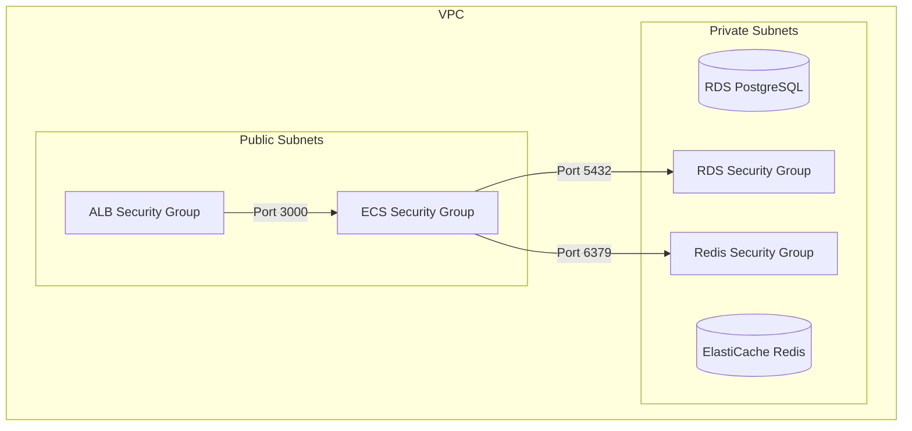

# Step 2: Security Groups and Data Layer

In this step, we will expand our CloudFormation template to include the necessary security groups and our data layer: an RDS PostgreSQL database and an ElastiCache Redis cluster.

## Architecture Addition



## Appending to the Template

Open your `demo-stack.yml` file and append the following new resources to the bottom of the file. Note that we're also adding some new parameters at the top.

### 1. Update the Parameters Block

Add the following database parameters directly beneath your existing `DemoPrefix` parameter:

```yaml
  DBUsername:
    Type: String
    Default: devops_demo
    Description: RDS master username

  DBPassword:
    Type: String
    NoEcho: true
    MinLength: 8
    Description: RDS master password (min 8 characters)

  DBName:
    Type: String
    Default: devops_demo
    Description: Initial database name

  AppPort:
    Type: Number
    Default: 3000
    Description: Container application port
```

### 2. Add Security Groups

Append the following to the `Resources` section (below your Route Tables):

```yaml
  # ─────────────────────────────────────────────────────────────────────
  # Security Groups
  # ─────────────────────────────────────────────────────────────────────
  AlbSecurityGroup:
    Type: AWS::EC2::SecurityGroup
    Properties:
      GroupName:
        Fn::Sub: "${DemoPrefix}-alb-sg"
      GroupDescription: Allow HTTP from internet to ALB
      VpcId:
        Ref: DemoVpc
      SecurityGroupIngress:
        - IpProtocol: tcp
          FromPort: 80
          ToPort: 80
          CidrIp: 0.0.0.0/0
      Tags:
        - Key: Name
          Value:
            Fn::Sub: "${DemoPrefix}-alb-sg"

  EcsSecurityGroup:
    Type: AWS::EC2::SecurityGroup
    Properties:
      GroupName:
        Fn::Sub: "${DemoPrefix}-ecs-sg"
      GroupDescription: Allow app traffic from ALB to ECS
      VpcId:
        Ref: DemoVpc
      SecurityGroupIngress:
        - IpProtocol: tcp
          FromPort:
            Ref: AppPort
          ToPort:
            Ref: AppPort
          SourceSecurityGroupId:
            Ref: AlbSecurityGroup
      Tags:
        - Key: Name
          Value:
            Fn::Sub: "${DemoPrefix}-ecs-sg"

  RdsSecurityGroup:
    Type: AWS::EC2::SecurityGroup
    Properties:
      GroupName:
        Fn::Sub: "${DemoPrefix}-rds-sg"
      GroupDescription: Allow PostgreSQL from ECS to RDS
      VpcId:
        Ref: DemoVpc
      SecurityGroupIngress:
        - IpProtocol: tcp
          FromPort: 5432
          ToPort: 5432
          SourceSecurityGroupId:
            Ref: EcsSecurityGroup
      Tags:
        - Key: Name
          Value:
            Fn::Sub: "${DemoPrefix}-rds-sg"

  RedisSecurityGroup:
    Type: AWS::EC2::SecurityGroup
    Properties:
      GroupName:
        Fn::Sub: "${DemoPrefix}-redis-sg"
      GroupDescription: Allow Redis from ECS
      VpcId:
        Ref: DemoVpc
      SecurityGroupIngress:
        - IpProtocol: tcp
          FromPort: 6379
          ToPort: 6379
          SourceSecurityGroupId:
            Ref: EcsSecurityGroup
      Tags:
        - Key: Name
          Value:
            Fn::Sub: "${DemoPrefix}-redis-sg"
```

### 3. Add Data Stores

Append the RDS and ElastiCache definitions to the `Resources` section:

```yaml
  # ─────────────────────────────────────────────────────────────────────
  # RDS PostgreSQL
  # ─────────────────────────────────────────────────────────────────────
  DbSubnetGroup:
    Type: AWS::RDS::DBSubnetGroup
    Properties:
      DBSubnetGroupName:
        Fn::Sub: "${DemoPrefix}-db-subnet"
      DBSubnetGroupDescription: RDS subnet group for private subnets
      SubnetIds:
        - Ref: PrivateSubnetA
        - Ref: PrivateSubnetB
      Tags:
        - Key: Name
          Value:
            Fn::Sub: "${DemoPrefix}-db-subnet"

  RdsInstance:
    Type: AWS::RDS::DBInstance
    Properties:
      DBInstanceIdentifier:
        Fn::Sub: "${DemoPrefix}-postgres"
      DBName:
        Ref: DBName
      Engine: postgres
      EngineVersion: '16'
      DBInstanceClass: db.t4g.micro
      AllocatedStorage: '20'
      StorageType: gp3
      MasterUsername:
        Ref: DBUsername
      MasterUserPassword:
        Ref: DBPassword
      DBSubnetGroupName:
        Ref: DbSubnetGroup
      VPCSecurityGroups:
        - Ref: RdsSecurityGroup
      PubliclyAccessible: false
      BackupRetentionPeriod: 0
      DeletionProtection: false
      Tags:
        - Key: Name
          Value:
            Fn::Sub: "${DemoPrefix}-postgres"

  # ─────────────────────────────────────────────────────────────────────
  # ElastiCache Redis (Serverless)
  # ─────────────────────────────────────────────────────────────────────
  CacheSubnetGroup:
    Type: AWS::ElastiCache::SubnetGroup
    Properties:
      CacheSubnetGroupName:
        Fn::Sub: "${DemoPrefix}-redis-subnet"
      Description: Redis subnet group for private subnets
      SubnetIds:
        - Ref: PrivateSubnetA
        - Ref: PrivateSubnetB
      Tags:
        - Key: Name
          Value:
            Fn::Sub: "${DemoPrefix}-redis-subnet"

  RedisServerlessCache:
    Type: AWS::ElastiCache::ServerlessCache
    Properties:
      ServerlessCacheName:
        Fn::Sub: "${DemoPrefix}-redis"
      Engine: redis
      SecurityGroupIds:
        - Ref: RedisSecurityGroup
      SubnetIds:
        - Ref: PrivateSubnetA
        - Ref: PrivateSubnetB
      Tags:
        - Key: Name
          Value:
            Fn::Sub: "${DemoPrefix}-redis"
```

### 4. Update Outputs

Append to the `Outputs` block:

```yaml
  RdsEndpoint:
    Description: RDS PostgreSQL endpoint
    Value:
      Fn::GetAtt:
        - RdsInstance
        - Endpoint.Address
    Export:
      Name:
        Fn::Sub: "${DemoPrefix}-rds-endpoint"

  RedisEndpoint:
    Description: ElastiCache Redis endpoint
    Value:
      Fn::GetAtt:
        - RedisServerlessCache
        - Endpoint.Address
    Export:
      Name:
        Fn::Sub: "${DemoPrefix}-redis-endpoint"
```

## Updating the Stack

Run the following command to update your existing stack with the new data layer resources. Because we are providing a database password parameter, we must supply it in the `--parameter-overrides`.

```bash
aws cloudformation deploy \
  --stack-name learn-devops-demo-stack \
  --template-file demo-stack.yml \
  --parameter-overrides \
    DBPassword=YourSecurePassword123
```

> ⏳ **Note:** Creating RDS instances and ElastiCache clusters can take 10-15 minutes. This is a great time to grab a coffee! ☕

## Next Steps

Once the database and cache are ready, proceed to [Step 3: Compute and Load Balancer](03-compute-and-load-balancer.md).
