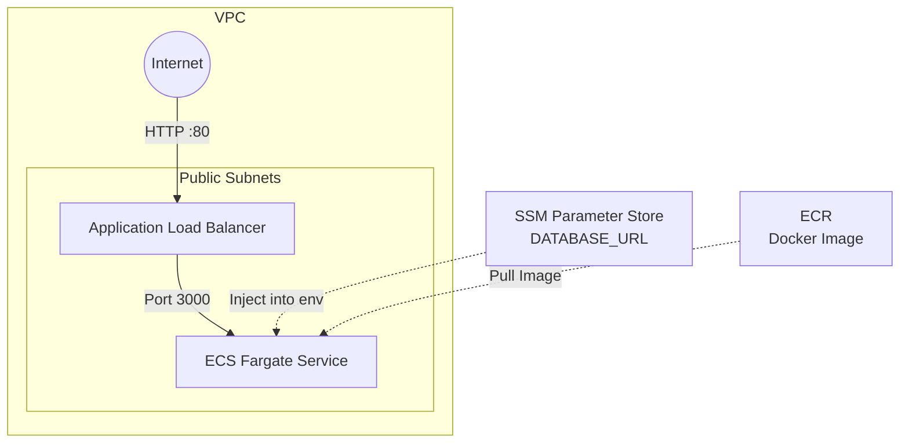

# Step 3: Compute and Load Balancer

With our network, security groups, and databases in place, we are ready to deploy our application container. This step introduces AWS Identity and Access Management (IAM) roles, Elastic Container Registry (ECR), the Application Load Balancer (ALB), and our Elastic Container Service (ECS) Fargate cluster.

## Architecture Addition



## Appending to the Template

### 1. Update the Parameters Block

Add the following container parameters below `AppPort`:

```yaml
  ImageTag:
    Type: String
    Default: demo-001
    Description: ECR image tag to deploy

  ContainerCpu:
    Type: Number
    Default: 256
    Description: CPU units for Fargate task (256 = 0.25 vCPU)

  ContainerMemory:
    Type: Number
    Default: 512
    Description: Memory for Fargate task (in MiB)

  DesiredCount:
    Type: Number
    Default: 1
    Description: Number of ECS tasks to run
```

### 2. Add ECR, SSM Parameter, and IAM Roles

Append these to the `Resources` section of your template:

```yaml
  # ─────────────────────────────────────────────────────────────────────
  # ECR Repository
  # ─────────────────────────────────────────────────────────────────────
  EcrRepository:
    Type: AWS::ECR::Repository
    Properties:
      RepositoryName:
        Fn::Sub: "${DemoPrefix}-node"
      ImageTagMutability: MUTABLE
      Tags:
        - Key: Name
          Value:
            Fn::Sub: "${DemoPrefix}-node"

  # ─────────────────────────────────────────────────────────────────────
  # SSM Parameter for DB URL
  # ─────────────────────────────────────────────────────────────────────
  DbUrlParameter:
    Type: AWS::SSM::Parameter
    Properties:
      Name:
        Fn::Sub: "/${DemoPrefix}/db-url"
      Type: String
      Value:
        Fn::Sub: "postgres://${DBUsername}:${DBPassword}@${RdsInstance.Endpoint.Address}:${RdsInstance.Endpoint.Port}/${DBName}?sslmode=require"
      Tags:
        Project:
          Ref: DemoPrefix

  # ─────────────────────────────────────────────────────────────────────
  # IAM Roles
  # ─────────────────────────────────────────────────────────────────────
  EcsTaskExecutionRole:
    Type: AWS::IAM::Role
    Properties:
      RoleName:
        Fn::Sub: "${DemoPrefix}-ecs-execution-role"
      AssumeRolePolicyDocument:
        Version: '2012-10-17'
        Statement:
          - Effect: Allow
            Principal:
              Service: ecs-tasks.amazonaws.com
            Action: sts:AssumeRole
      ManagedPolicyArns:
        - arn:aws:iam::aws:policy/service-role/AmazonECSTaskExecutionRolePolicy
      Policies:
        - PolicyName: ReadDbUrlSsmParameter
          PolicyDocument:
            Version: '2012-10-17'
            Statement:
              - Effect: Allow
                Action:
                  - ssm:GetParameter
                  - ssm:GetParameters
                Resource:
                  Fn::Sub: "arn:aws:ssm:${AWS::Region}:${AWS::AccountId}:parameter/${DemoPrefix}/db-url"
      Tags:
        - Key: Name
          Value:
            Fn::Sub: "${DemoPrefix}-ecs-execution-role"

  EcsTaskRole:
    Type: AWS::IAM::Role
    Properties:
      RoleName:
        Fn::Sub: "${DemoPrefix}-ecs-task-role"
      AssumeRolePolicyDocument:
        Version: '2012-10-17'
        Statement:
          - Effect: Allow
            Principal:
              Service: ecs-tasks.amazonaws.com
            Action: sts:AssumeRole
      Tags:
        - Key: Name
          Value:
            Fn::Sub: "${DemoPrefix}-ecs-task-role"
```

### 3. Add Application Load Balancer (ALB)

Append the Load Balancer, Listener, and Target Group to `Resources`:

```yaml
  # ─────────────────────────────────────────────────────────────────────
  # ALB
  # ─────────────────────────────────────────────────────────────────────
  ApplicationLoadBalancer:
    Type: AWS::ElasticLoadBalancingV2::LoadBalancer
    Properties:
      Name:
        Fn::Sub: "${DemoPrefix}-alb"
      Scheme: internet-facing
      Type: application
      IpAddressType: ipv4
      Subnets:
        - Ref: PublicSubnetA
        - Ref: PublicSubnetB
      SecurityGroups:
        - Ref: AlbSecurityGroup
      Tags:
        - Key: Name
          Value:
            Fn::Sub: "${DemoPrefix}-alb"

  AlbListener:
    Type: AWS::ElasticLoadBalancingV2::Listener
    Properties:
      LoadBalancerArn:
        Ref: ApplicationLoadBalancer
      Port: 80
      Protocol: HTTP
      DefaultActions:
        - Type: forward
          TargetGroupArn:
            Ref: EcsTargetGroup

  EcsTargetGroup:
    Type: AWS::ElasticLoadBalancingV2::TargetGroup
    Properties:
      Name:
        Fn::Sub: "${DemoPrefix}-node-tg"
      Port:
        Ref: AppPort
      Protocol: HTTP
      TargetType: ip
      VpcId:
        Ref: DemoVpc
      HealthCheckPath: /health
      HealthCheckProtocol: HTTP
      HealthCheckIntervalSeconds: 30
      HealthCheckTimeoutSeconds: 5
      HealthyThresholdCount: 2
      UnhealthyThresholdCount: 3
      Tags:
        - Key: Name
          Value:
            Fn::Sub: "${DemoPrefix}-node-tg"
```

### 4. Add ECS Cluster and Service

> **Note:** The `LogConfiguration` section of the `EcsTaskDefinition` references a Log Group we haven't created yet, so we will omit logging from this step and add it in Step 4.

Append the ECS Cluster, Task Definition, and Service to `Resources`:

```yaml
  # ─────────────────────────────────────────────────────────────────────
  # ECS Cluster & Service
  # ─────────────────────────────────────────────────────────────────────
  EcsCluster:
    Type: AWS::ECS::Cluster
    Properties:
      ClusterName:
        Fn::Sub: "${DemoPrefix}-cluster"
      Tags:
        - Key: Name
          Value:
            Fn::Sub: "${DemoPrefix}-cluster"

  EcsTaskDefinition:
    Type: AWS::ECS::TaskDefinition
    Properties:
      Family:
        Fn::Sub: "${DemoPrefix}-node"
      Cpu:
        Ref: ContainerCpu
      Memory:
        Ref: ContainerMemory
      NetworkMode: awsvpc
      RequiresCompatibilities:
        - FARGATE
      ExecutionRoleArn:
        Ref: EcsTaskExecutionRole
      TaskRoleArn:
        Ref: EcsTaskRole
      ContainerDefinitions:
        - Name: app
          Image:
            Fn::Sub: "${AWS::AccountId}.dkr.ecr.${AWS::Region}.amazonaws.com/${DemoPrefix}-node:${ImageTag}"
          Essential: true
          PortMappings:
            - ContainerPort:
                Ref: AppPort
              Protocol: tcp
          Environment:
            - Name: PORT
              Value:
                Ref: AppPort
            - Name: HOST
              Value: 0.0.0.0
          Secrets:
            - Name: DATABASE_URL
              ValueFrom:
                Ref: DbUrlParameter
      Tags:
        - Key: Name
          Value:
            Fn::Sub: "${DemoPrefix}-node"

  EcsService:
    Type: AWS::ECS::Service
    DependsOn:
      - AlbListener
      - RdsInstance
    Properties:
      ServiceName:
        Fn::Sub: "${DemoPrefix}-node-service"
      Cluster:
        Ref: EcsCluster
      TaskDefinition:
        Ref: EcsTaskDefinition
      DesiredCount:
        Ref: DesiredCount
      LaunchType: FARGATE
      NetworkConfiguration:
        AwsvpcConfiguration:
          Subnets:
            - Ref: PublicSubnetA
            - Ref: PublicSubnetB
          SecurityGroups:
            - Ref: EcsSecurityGroup
          AssignPublicIp: ENABLED
      LoadBalancers:
        - ContainerName: app
          ContainerPort:
            Ref: AppPort
          TargetGroupArn:
            Ref: EcsTargetGroup
      Tags:
        - Key: Name
          Value:
            Fn::Sub: "${DemoPrefix}-node-service"
```

### 5. Update Outputs

Append to the `Outputs` block:

```yaml
  AlbDnsName:
    Description: ALB public DNS name
    Value:
      Fn::GetAtt:
        - ApplicationLoadBalancer
        - DNSName
    Export:
      Name:
        Fn::Sub: "${DemoPrefix}-alb-dns"

  EcrRepositoryUri:
    Description: ECR repository URI
    Value:
      Fn::Sub: "${AWS::AccountId}.dkr.ecr.${AWS::Region}.amazonaws.com/${DemoPrefix}-node"
    Export:
      Name:
        Fn::Sub: "${DemoPrefix}-ecr-uri"
```

## Updating the Stack

Because our template now creates **IAM Roles**, we must explicitly acknowledge this capability during deployment by using `--capabilities CAPABILITY_NAMED_IAM`.

Run the following command:

```bash
aws cloudformation deploy \
  --stack-name learn-devops-demo-stack \
  --template-file template.yml \
  --capabilities CAPABILITY_NAMED_IAM
```

Once the stack is updated, you can find the `AlbDnsName` in the CloudFormation console's Outputs tab.

> **Note:** If you haven't pushed a Docker image to your new ECR repository yet, the ECS service will fail to start tasks until the `demo-001` image is pushed.

## Next Steps

With your app running, it's time to add monitoring. Proceed to [Step 4: Observability and Full Stack](04-observability-and-full-stack.md).
