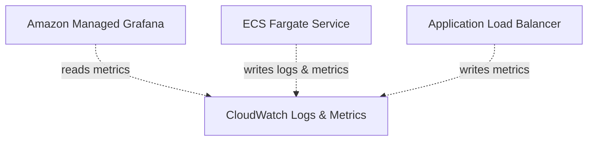

# Step 4: Observability and the Full Stack

In this final step, we will complete our CloudFormation stack by adding observability. This ensures we can monitor our application's health, view its logs, and alert on issues. We will add CloudWatch Logs, a CPU Alarm, a custom CloudWatch Dashboard, and an Amazon Managed Grafana Workspace.

## Architecture Addition



## Appending to the Template

### 1. Update the Parameters Block

Add the log retention parameter to your `Parameters` section:

```yaml
  LogRetentionDays:
    Type: Number
    Default: 3
    Description: CloudWatch log retention in days
```

### 2. Add the CloudWatch Log Group

Append the Log Group to the `Resources` block (before or near the ECS Cluster makes sense, but anywhere in `Resources` is fine):

```yaml
  # ─────────────────────────────────────────────────────────────────────
  # CloudWatch Log Group
  # ─────────────────────────────────────────────────────────────────────
  EcsLogGroup:
    Type: AWS::Logs::LogGroup
    Properties:
      LogGroupName:
        Fn::Sub: "/ecs/${DemoPrefix}-node"
      RetentionInDays:
        Ref: LogRetentionDays
      Tags:
        - Key: Name
          Value:
            Fn::Sub: "${DemoPrefix}-ecs-logs"
```

### 3. Update the ECS Task Definition

Now that we have a Log Group, we can tell ECS where to send application logs. Locate your existing `EcsTaskDefinition` and add the `LogConfiguration` block under the `app` container definition.

Your updated `ContainerDefinitions` should look like this:

```yaml
      ContainerDefinitions:
        - Name: app
          Image:
            Fn::Sub: "${AWS::AccountId}.dkr.ecr.${AWS::Region}.amazonaws.com/${DemoPrefix}-node:${ImageTag}"
          Essential: true
          PortMappings:
            - ContainerPort:
                Ref: AppPort
              Protocol: tcp
          Environment:
            - Name: PORT
              Value:
                Ref: AppPort
            - Name: HOST
              Value: 0.0.0.0
          Secrets:
            - Name: DATABASE_URL
              ValueFrom:
                Ref: DbUrlParameter
          LogConfiguration:
            LogDriver: awslogs
            Options:
              awslogs-group:
                Ref: EcsLogGroup
              awslogs-region:
                Ref: AWS::Region
              awslogs-stream-prefix: ecs
```

### 4. Add Alarms, Dashboards, and Grafana

Append these final resources to the bottom of the `Resources` block:

```yaml
  # ─────────────────────────────────────────────────────────────────────
  # CloudWatch Alarm
  # ─────────────────────────────────────────────────────────────────────
  CpuAlarm:
    Type: AWS::CloudWatch::Alarm
    Properties:
      AlarmName:
        Fn::Sub: "${DemoPrefix}-ecs-cpu-high"
      AlarmDescription: Alert when ECS CPU exceeds 80%
      Namespace: AWS/ECS
      MetricName: CPUUtilization
      Dimensions:
        - Name: ClusterName
          Value:
            Ref: EcsCluster
        - Name: ServiceName
          Value:
            Fn::GetAtt:
              - EcsService
              - Name
      Statistic: Average
      Period: 300
      EvaluationPeriods: 2
      Threshold: 80
      ComparisonOperator: GreaterThanThreshold
      Tags:
        - Key: Name
          Value:
            Fn::Sub: "${DemoPrefix}-ecs-cpu-alarm"

  # ─────────────────────────────────────────────────────────────────────
  # CloudWatch Dashboard
  # ─────────────────────────────────────────────────────────────────────
  DemoDashboard:
    Type: AWS::CloudWatch::Dashboard
    Properties:
      DashboardName:
        Fn::Sub: "${DemoPrefix}-dashboard"
      DashboardBody:
        Fn::Sub: |
          {
            "widgets": [
              {
                "type": "metric",
                "x": 0, "y": 0, "width": 12, "height": 6,
                "properties": {
                  "metrics": [
                    ["AWS/ECS", "CPUUtilization", "ClusterName", "${EcsCluster}", "ServiceName", "${EcsService.Name}"]
                  ],
                  "view": "timeSeries",
                  "stacked": false,
                  "region": "${AWS::Region}",
                  "title": "ECS CPU Utilization",
                  "period": 300
                }
              },
              {
                "type": "metric",
                "x": 12, "y": 0, "width": 12, "height": 6,
                "properties": {
                  "metrics": [
                    ["AWS/ECS", "MemoryUtilization", "ClusterName", "${EcsCluster}", "ServiceName", "${EcsService.Name}"]
                  ],
                  "view": "timeSeries",
                  "stacked": false,
                  "region": "${AWS::Region}",
                  "title": "ECS Memory Utilization",
                  "period": 300
                }
              },
              {
                "type": "metric",
                "x": 0, "y": 6, "width": 12, "height": 6,
                "properties": {
                  "metrics": [
                    ["AWS/ApplicationELB", "TargetResponseTime", "LoadBalancer", "${ApplicationLoadBalancer.LoadBalancerFullName}"]
                  ],
                  "view": "timeSeries",
                  "stacked": false,
                  "region": "${AWS::Region}",
                  "title": "ALB Target Response Time",
                  "period": 300
                }
              },
              {
                "type": "metric",
                "x": 12, "y": 6, "width": 12, "height": 6,
                "properties": {
                  "metrics": [
                    ["AWS/ApplicationELB", "HTTPCode_Target_5XX_Count", "LoadBalancer", "${ApplicationLoadBalancer.LoadBalancerFullName}"]
                  ],
                  "view": "timeSeries",
                  "stacked": false,
                  "region": "${AWS::Region}",
                  "title": "ALB 5XX Errors",
                  "period": 300
                }
              }
            ]
          }

  # ─────────────────────────────────────────────────────────────────────
  # Amazon Managed Grafana Workspace
  # ⚠️ Requires AWS Grafana service-linked roles and IAM Identity Center
  # ─────────────────────────────────────────────────────────────────────
  GrafanaWorkspace:
    Type: AWS::Grafana::Workspace
    Properties:
      Name:
        Fn::Sub: "${DemoPrefix}-grafana"
      AccountAccessType: CURRENT_ACCOUNT
      AuthenticationProviders:
        - AWS_SSO
      PermissionType: SERVICE_MANAGED
      DataSources:
        - CLOUDWATCH
      Description: Demo Grafana workspace for learn-devops
```

### 5. Update Outputs

Finally, append the Grafana endpoint to your `Outputs`:

```yaml
  GrafanaEndpoint:
    Description: Grafana workspace URL
    Value:
      Fn::GetAtt:
        - GrafanaWorkspace
        - Endpoint
    Export:
      Name:
        Fn::Sub: "${DemoPrefix}-grafana-endpoint"
```

## Updating the Stack

Run your final deployment command:

```bash
aws cloudformation deploy \
  --stack-name learn-devops-demo-stack \
  --template-file demo-stack.yml \
  --parameter-overrides \
    DBPassword=YourSecurePassword123 \
  --capabilities CAPABILITY_NAMED_IAM
```

## Congratulations! 🎉

You have successfully built the complete architecture using step-by-step CloudFormation! Your `demo-stack.yml` should now be functionally identical to the complete `14-cloudformation.md` template. 

### Cleaning Up

When you are finished learning, don't forget to delete your stack to avoid unexpected AWS charges:

```bash
aws cloudformation delete-stack --stack-name learn-devops-demo-stack
```
