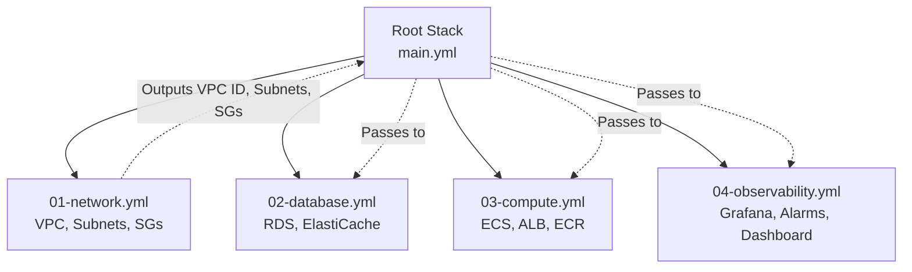

# Step 5: Nested Stacks (Modularity)

As your infrastructure grows, a single `template.yml` file can become thousands of lines long, making it difficult to read, maintain, and review. CloudFormation provides **Nested Stacks** to solve this problem.

Nested stacks allow you to create CloudFormation templates and reference them from within another CloudFormation template. This lets you break down a monolithic template into smaller, reusable modules.

## Architecture of Nested Stacks

Instead of one giant template, we will organize our infrastructure into 4 child stacks and 1 root stack:



In this step, we will create these 5 files.

---

## 1. Network Stack (`01-network.yml`)

Create a new file named `01-network.yml`. This contains the VPC, Subnets, Route Tables, and Security Groups. Notice the `Outputs` section at the bottom: this is how we export values to the root stack.

```yaml
AWSTemplateFormatVersion: '2010-09-09'
Description: Network Stack - VPC, Subnets, Security Groups

Parameters:
  DemoPrefix:
    Type: String
  AppPort:
    Type: Number

Resources:
  DemoVpc:
    Type: AWS::EC2::VPC
    Properties:
      CidrBlock: 10.0.0.0/16
      EnableDnsSupport: true
      EnableDnsHostnames: true
      Tags:
        - Key: Name
          Value: !Sub "${DemoPrefix}-vpc"

  InternetGateway:
    Type: AWS::EC2::InternetGateway
    Properties:
      Tags:
        - Key: Name
          Value: !Sub "${DemoPrefix}-igw"

  VpcGatewayAttachment:
    Type: AWS::EC2::VPCGatewayAttachment
    Properties:
      VpcId: !Ref DemoVpc
      InternetGatewayId: !Ref InternetGateway

  PublicSubnetA:
    Type: AWS::EC2::Subnet
    Properties:
      VpcId: !Ref DemoVpc
      AvailabilityZone: !Select [0, !GetAZs '']
      MapPublicIpOnLaunch: true
      CidrBlock: 10.0.1.0/24
      Tags:
        - Key: Name
          Value: !Sub "${DemoPrefix}-public-a"

  PublicSubnetB:
    Type: AWS::EC2::Subnet
    Properties:
      VpcId: !Ref DemoVpc
      AvailabilityZone: !Select [1, !GetAZs '']
      MapPublicIpOnLaunch: true
      CidrBlock: 10.0.2.0/24
      Tags:
        - Key: Name
          Value: !Sub "${DemoPrefix}-public-b"

  PrivateSubnetA:
    Type: AWS::EC2::Subnet
    Properties:
      VpcId: !Ref DemoVpc
      AvailabilityZone: !Select [0, !GetAZs '']
      CidrBlock: 10.0.11.0/24
      Tags:
        - Key: Name
          Value: !Sub "${DemoPrefix}-private-a"

  PrivateSubnetB:
    Type: AWS::EC2::Subnet
    Properties:
      VpcId: !Ref DemoVpc
      AvailabilityZone: !Select [1, !GetAZs '']
      CidrBlock: 10.0.12.0/24
      Tags:
        - Key: Name
          Value: !Sub "${DemoPrefix}-private-b"

  PublicRouteTable:
    Type: AWS::EC2::RouteTable
    Properties:
      VpcId: !Ref DemoVpc
      Tags:
        - Key: Name
          Value: !Sub "${DemoPrefix}-public-rt"

  PublicRoute:
    Type: AWS::EC2::Route
    DependsOn: VpcGatewayAttachment
    Properties:
      RouteTableId: !Ref PublicRouteTable
      DestinationCidrBlock: 0.0.0.0/0
      GatewayId: !Ref InternetGateway

  PublicSubnetARouteTableAssociation:
    Type: AWS::EC2::SubnetRouteTableAssociation
    Properties:
      SubnetId: !Ref PublicSubnetA
      RouteTableId: !Ref PublicRouteTable

  PublicSubnetBRouteTableAssociation:
    Type: AWS::EC2::SubnetRouteTableAssociation
    Properties:
      SubnetId: !Ref PublicSubnetB
      RouteTableId: !Ref PublicRouteTable

  AlbSecurityGroup:
    Type: AWS::EC2::SecurityGroup
    Properties:
      GroupName: !Sub "${DemoPrefix}-alb-sg"
      GroupDescription: Allow HTTP from internet to ALB
      VpcId: !Ref DemoVpc
      SecurityGroupIngress:
        - IpProtocol: tcp
          FromPort: 80
          ToPort: 80
          CidrIp: 0.0.0.0/0
      Tags:
        - Key: Name
          Value: !Sub "${DemoPrefix}-alb-sg"

  EcsSecurityGroup:
    Type: AWS::EC2::SecurityGroup
    Properties:
      GroupName: !Sub "${DemoPrefix}-ecs-sg"
      GroupDescription: Allow app traffic from ALB to ECS
      VpcId: !Ref DemoVpc
      SecurityGroupIngress:
        - IpProtocol: tcp
          FromPort: !Ref AppPort
          ToPort: !Ref AppPort
          SourceSecurityGroupId: !Ref AlbSecurityGroup
      Tags:
        - Key: Name
          Value: !Sub "${DemoPrefix}-ecs-sg"

  RdsSecurityGroup:
    Type: AWS::EC2::SecurityGroup
    Properties:
      GroupName: !Sub "${DemoPrefix}-rds-sg"
      GroupDescription: Allow PostgreSQL from ECS to RDS
      VpcId: !Ref DemoVpc
      SecurityGroupIngress:
        - IpProtocol: tcp
          FromPort: 5432
          ToPort: 5432
          SourceSecurityGroupId: !Ref EcsSecurityGroup
      Tags:
        - Key: Name
          Value: !Sub "${DemoPrefix}-rds-sg"

  RedisSecurityGroup:
    Type: AWS::EC2::SecurityGroup
    Properties:
      GroupName: !Sub "${DemoPrefix}-redis-sg"
      GroupDescription: Allow Redis from ECS
      VpcId: !Ref DemoVpc
      SecurityGroupIngress:
        - IpProtocol: tcp
          FromPort: 6379
          ToPort: 6379
          SourceSecurityGroupId: !Ref EcsSecurityGroup
      Tags:
        - Key: Name
          Value: !Sub "${DemoPrefix}-redis-sg"

Outputs:
  VpcId:
    Value: !Ref DemoVpc
  PublicSubnetIds:
    Value: !Join [",", [!Ref PublicSubnetA, !Ref PublicSubnetB]]
  PrivateSubnetIds:
    Value: !Join [",", [!Ref PrivateSubnetA, !Ref PrivateSubnetB]]
  AlbSecurityGroupId:
    Value: !Ref AlbSecurityGroup
  EcsSecurityGroupId:
    Value: !Ref EcsSecurityGroup
  RdsSecurityGroupId:
    Value: !Ref RdsSecurityGroup
  RedisSecurityGroupId:
    Value: !Ref RedisSecurityGroup
```

---

## 2. Database Stack (`02-database.yml`)

Create `02-database.yml`. This stack accepts Subnet IDs and Security Group IDs passed from the Network stack.

```yaml
AWSTemplateFormatVersion: '2010-09-09'
Description: Database Stack - RDS, ElastiCache

Parameters:
  DemoPrefix:
    Type: String
  DBUsername:
    Type: String
  DBPassword:
    Type: String
    NoEcho: true
  DBName:
    Type: String
  PrivateSubnetIds:
    Type: CommaDelimitedList
  RdsSecurityGroupId:
    Type: String
  RedisSecurityGroupId:
    Type: String

Resources:
  DbSubnetGroup:
    Type: AWS::RDS::DBSubnetGroup
    Properties:
      DBSubnetGroupName: !Sub "${DemoPrefix}-db-subnet"
      DBSubnetGroupDescription: RDS subnet group for private subnets
      SubnetIds: !Ref PrivateSubnetIds
      Tags:
        - Key: Name
          Value: !Sub "${DemoPrefix}-db-subnet"

  RdsInstance:
    Type: AWS::RDS::DBInstance
    Properties:
      DBInstanceIdentifier: !Sub "${DemoPrefix}-postgres"
      DBName: !Ref DBName
      Engine: postgres
      EngineVersion: "16"
      DBInstanceClass: db.t4g.micro
      AllocatedStorage: "20"
      StorageType: gp3
      MasterUsername: !Ref DBUsername
      MasterUserPassword: !Ref DBPassword
      DBSubnetGroupName: !Ref DbSubnetGroup
      VPCSecurityGroups:
        - !Ref RdsSecurityGroupId
      PubliclyAccessible: false
      BackupRetentionPeriod: 0
      DeletionProtection: false
      Tags:
        - Key: Name
          Value: !Sub "${DemoPrefix}-postgres"

  CacheSubnetGroup:
    Type: AWS::ElastiCache::SubnetGroup
    Properties:
      CacheSubnetGroupName: !Sub "${DemoPrefix}-redis-subnet"
      Description: Redis subnet group for private subnets
      SubnetIds: !Ref PrivateSubnetIds
      Tags:
        - Key: Name
          Value: !Sub "${DemoPrefix}-redis-subnet"

  RedisServerlessCache:
    Type: AWS::ElastiCache::ServerlessCache
    Properties:
      ServerlessCacheName: !Sub "${DemoPrefix}-redis"
      Engine: redis
      SecurityGroupIds:
        - !Ref RedisSecurityGroupId
      SubnetIds: !Ref PrivateSubnetIds
      Tags:
        - Key: Name
          Value: !Sub "${DemoPrefix}-redis"

Outputs:
  RdsEndpointAddress:
    Value: !GetAtt RdsInstance.Endpoint.Address
  RdsEndpointPort:
    Value: !GetAtt RdsInstance.Endpoint.Port
  RedisEndpointAddress:
    Value: !GetAtt RedisServerlessCache.Endpoint.Address
```

---

## 3. Compute Stack (`03-compute.yml`)

Create `03-compute.yml`. This is the largest piece, containing the ALB, ECS Cluster, and ECR. It relies on the Network Stack for networking and the Database Stack for the connection URL.

```yaml
AWSTemplateFormatVersion: '2010-09-09'
Description: Compute Stack - ECS, ALB, ECR

Parameters:
  DemoPrefix:
    Type: String
  AppPort:
    Type: Number
  ImageTag:
    Type: String
  ContainerCpu:
    Type: Number
  ContainerMemory:
    Type: Number
  DesiredCount:
    Type: Number
  LogRetentionDays:
    Type: Number
  DBUsername:
    Type: String
  DBPassword:
    Type: String
    NoEcho: true
  DBName:
    Type: String
  RdsEndpointAddress:
    Type: String
  RdsEndpointPort:
    Type: String
  VpcId:
    Type: String
  PublicSubnetIds:
    Type: CommaDelimitedList
  AlbSecurityGroupId:
    Type: String
  EcsSecurityGroupId:
    Type: String

Resources:
  EcrRepository:
    Type: AWS::ECR::Repository
    Properties:
      RepositoryName: !Sub "${DemoPrefix}-node"
      ImageTagMutability: MUTABLE
      Tags:
        - Key: Name
          Value: !Sub "${DemoPrefix}-node"

  DbUrlParameter:
    Type: AWS::SSM::Parameter
    Properties:
      Name: !Sub "/${DemoPrefix}/db-url"
      Type: String
      Value: !Sub "postgres://${DBUsername}:${DBPassword}@${RdsEndpointAddress}:${RdsEndpointPort}/${DBName}?sslmode=require"
      Tags:
        Project: !Ref DemoPrefix

  EcsTaskExecutionRole:
    Type: AWS::IAM::Role
    Properties:
      RoleName: !Sub "${DemoPrefix}-ecs-execution-role"
      AssumeRolePolicyDocument:
        Version: "2012-10-17"
        Statement:
          - Effect: Allow
            Principal:
              Service: ecs-tasks.amazonaws.com
            Action: sts:AssumeRole
      ManagedPolicyArns:
        - arn:aws:iam::aws:policy/service-role/AmazonECSTaskExecutionRolePolicy
      Policies:
        - PolicyName: ReadDbUrlSsmParameter
          PolicyDocument:
            Version: "2012-10-17"
            Statement:
              - Effect: Allow
                Action:
                  - ssm:GetParameter
                  - ssm:GetParameters
                Resource: !Sub "arn:aws:ssm:${AWS::Region}:${AWS::AccountId}:parameter/${DemoPrefix}/db-url"
      Tags:
        - Key: Name
          Value: !Sub "${DemoPrefix}-ecs-execution-role"

  EcsTaskRole:
    Type: AWS::IAM::Role
    Properties:
      RoleName: !Sub "${DemoPrefix}-ecs-task-role"
      AssumeRolePolicyDocument:
        Version: "2012-10-17"
        Statement:
          - Effect: Allow
            Principal:
              Service: ecs-tasks.amazonaws.com
            Action: sts:AssumeRole
      Tags:
        - Key: Name
          Value: !Sub "${DemoPrefix}-ecs-task-role"

  ApplicationLoadBalancer:
    Type: AWS::ElasticLoadBalancingV2::LoadBalancer
    Properties:
      Name: !Sub "${DemoPrefix}-alb"
      Scheme: internet-facing
      Type: application
      IpAddressType: ipv4
      Subnets: !Ref PublicSubnetIds
      SecurityGroups:
        - !Ref AlbSecurityGroupId
      Tags:
        - Key: Name
          Value: !Sub "${DemoPrefix}-alb"

  EcsTargetGroup:
    Type: AWS::ElasticLoadBalancingV2::TargetGroup
    Properties:
      Name: !Sub "${DemoPrefix}-node-tg"
      Port: !Ref AppPort
      Protocol: HTTP
      TargetType: ip
      VpcId: !Ref VpcId
      HealthCheckPath: /health
      HealthCheckProtocol: HTTP
      HealthCheckIntervalSeconds: 30
      HealthCheckTimeoutSeconds: 5
      HealthyThresholdCount: 2
      UnhealthyThresholdCount: 3
      Tags:
        - Key: Name
          Value: !Sub "${DemoPrefix}-node-tg"

  AlbListener:
    Type: AWS::ElasticLoadBalancingV2::Listener
    Properties:
      LoadBalancerArn: !Ref ApplicationLoadBalancer
      Port: 80
      Protocol: HTTP
      DefaultActions:
        - Type: forward
          TargetGroupArn: !Ref EcsTargetGroup

  EcsCluster:
    Type: AWS::ECS::Cluster
    Properties:
      ClusterName: !Sub "${DemoPrefix}-cluster"
      Tags:
        - Key: Name
          Value: !Sub "${DemoPrefix}-cluster"

  EcsLogGroup:
    Type: AWS::Logs::LogGroup
    Properties:
      LogGroupName: !Sub "/ecs${DemoPrefix}-node"
      RetentionInDays: !Ref LogRetentionDays
      Tags:
        - Key: Name
          Value: !Sub "${DemoPrefix}-ecs-logs"

  EcsTaskDefinition:
    Type: AWS::ECS::TaskDefinition
    Properties:
      Family: !Sub "${DemoPrefix}-node"
      Cpu: !Ref ContainerCpu
      Memory: !Ref ContainerMemory
      NetworkMode: awsvpc
      RequiresCompatibilities:
        - FARGATE
      RuntimePlatform:
        CpuArchitecture: ARM64
        OperatingSystemFamily: LINUX
      ExecutionRoleArn: !Ref EcsTaskExecutionRole
      TaskRoleArn: !Ref EcsTaskRole
      ContainerDefinitions:
        - Name: app
          Image: !Sub "${AWS::AccountId}.dkr.ecr.${AWS::Region}.amazonaws.com/${DemoPrefix}-node:${ImageTag}"
          Essential: true
          PortMappings:
            - ContainerPort: !Ref AppPort
              Protocol: tcp
          Environment:
            - Name: PORT
              Value: !Ref AppPort
            - Name: HOST
              Value: 0.0.0.0
          Secrets:
            - Name: DATABASE_URL
              ValueFrom: !Sub "arn:aws:ssm:${AWS::Region}:${AWS::AccountId}:parameter/${DemoPrefix}/db-url"
          LogConfiguration:
            LogDriver: awslogs
            Options:
              awslogs-group: !Sub "/ecs${DemoPrefix}-node"
              awslogs-region: !Sub "${AWS::Region}"
              awslogs-stream-prefix: ecs
      Tags:
        - Key: Name
          Value: !Sub "${DemoPrefix}-node"

  EcsService:
    Type: AWS::ECS::Service
    DependsOn:
      - AlbListener
    Properties:
      ServiceName: !Sub "${DemoPrefix}-node-service"
      Cluster: !Ref EcsCluster
      TaskDefinition: !Ref EcsTaskDefinition
      DesiredCount: !Ref DesiredCount
      LaunchType: FARGATE
      NetworkConfiguration:
        AwsvpcConfiguration:
          Subnets: !Ref PublicSubnetIds
          SecurityGroups:
            - !Ref EcsSecurityGroupId
          AssignPublicIp: ENABLED
      LoadBalancers:
        - ContainerName: app
          ContainerPort: !Ref AppPort
          TargetGroupArn: !Ref EcsTargetGroup
      Tags:
        - Key: Name
          Value: !Sub "${DemoPrefix}-node-service"

Outputs:
  AlbDnsName:
    Value: !GetAtt ApplicationLoadBalancer.DNSName
  EcrRepositoryUri:
    Value: !Sub "${AWS::AccountId}.dkr.ecr.${AWS::Region}.amazonaws.com/${DemoPrefix}-node"
  EcsClusterName:
    Value: !Ref EcsCluster
  EcsServiceName:
    Value: !GetAtt EcsService.Name
  ApplicationLoadBalancerFullName:
    Value: !GetAtt ApplicationLoadBalancer.LoadBalancerFullName
```

---

## 4. Observability Stack (`04-observability.yml`)

Create `04-observability.yml`. This monitors the compute stack.

```yaml
AWSTemplateFormatVersion: '2010-09-09'
Description: Observability Stack - Dashboard, Alarms, Grafana

Parameters:
  DemoPrefix:
    Type: String
  EcsClusterName:
    Type: String
  EcsServiceName:
    Type: String
  ALBFullName:
    Type: String

Resources:
  CpuAlarm:
    Type: AWS::CloudWatch::Alarm
    Properties:
      AlarmName: !Sub "${DemoPrefix}-ecs-cpu-high"
      AlarmDescription: Alert when ECS CPU exceeds 80%
      Namespace: AWS/ECS
      MetricName: CPUUtilization
      Dimensions:
        - Name: ClusterName
          Value: !Ref EcsClusterName
        - Name: ServiceName
          Value: !Ref EcsServiceName
      Statistic: Average
      Period: 300
      EvaluationPeriods: 2
      Threshold: 80
      ComparisonOperator: GreaterThanThreshold
      Tags:
        - Key: Name
          Value: !Sub "${DemoPrefix}-ecs-cpu-alarm"

  DemoDashboard:
    Type: AWS::CloudWatch::Dashboard
    Properties:
      DashboardName: !Sub "${DemoPrefix}-dashboard"
      DashboardBody: !Sub
        - |
          {
            "widgets": [
              {
                "type": "metric",
                "x": 0, "y": 0, "width": 12, "height": 6,
                "properties": {
                  "metrics": [
                    ["AWS/ECS", "CPUUtilization", "ClusterName", "${EcsCluster}", "ServiceName", "${EcsService}"]
                  ],
                  "view": "timeSeries",
                  "stacked": false,
                  "region": "${AWS::Region}",
                  "title": "ECS CPU Utilization",
                  "period": 300
                }
              },
              {
                "type": "metric",
                "x": 0, "y": 6, "width": 12, "height": 6,
                "properties": {
                  "metrics": [
                    ["AWS/ApplicationELB", "TargetResponseTime", "LoadBalancer", "${ALB}"]
                  ],
                  "view": "timeSeries",
                  "stacked": false,
                  "region": "${AWS::Region}",
                  "title": "ALB Target Response Time",
                  "period": 300
                }
              }
            ]
          }
        - ALB: !Ref ALBFullName
          EcsCluster: !Ref EcsClusterName
          EcsService: !Ref EcsServiceName

  GrafanaRole:
    Type: AWS::IAM::Role
    Properties:
      RoleName: !Sub "${DemoPrefix}-grafana-role"
      AssumeRolePolicyDocument:
        Version: "2012-10-17"
        Statement:
          - Effect: Allow
            Principal:
              Service: grafana.amazonaws.com
            Action: sts:AssumeRole
      ManagedPolicyArns:
        - arn:aws:iam::aws:policy/service-role/AmazonGrafanaCloudWatchAccess
      Tags:
        - Key: Name
          Value: !Sub "${DemoPrefix}-grafana-role"

  GrafanaWorkspace:
    Type: AWS::Grafana::Workspace
    Properties:
      AccountAccessType: CURRENT_ACCOUNT
      AuthenticationProviders:
        - AWS_SSO
      DataSources:
        - CLOUDWATCH
      Description: Demo Grafana workspace for learn-devops
      PermissionType: CUSTOMER_MANAGED
      RoleArn: !GetAtt GrafanaRole.Arn
      Name: !Sub "${DemoPrefix}-grafana"

Outputs:
  GrafanaEndpoint:
    Value: !GetAtt GrafanaWorkspace.Endpoint
```

---

## 5. The Root Stack (`main.yml`)

Finally, create `main.yml`. This uses `AWS::CloudFormation::Stack` to tie them all together. It passes outputs from one stack as parameters to another.

Notice the `TemplateURL: ./file.yml`. CloudFormation actually requires this to be an S3 URL. We will fix that using the `package` command below.

```yaml
AWSTemplateFormatVersion: '2010-09-09'
Description: Root Stack - Connects all nested stacks together

Parameters:
  DemoPrefix:
    Type: String
    Default: learn-devops-demo
  DBUsername:
    Type: String
    Default: devops_demo
  DBPassword:
    Type: String
    Default: "DevOpsDemo123!"
    NoEcho: true
    MinLength: 8
  DBName:
    Type: String
    Default: devops_demo
  AppPort:
    Type: Number
    Default: 3000
  ImageTag:
    Type: String
    Default: demo-001
  ContainerCpu:
    Type: Number
    Default: 256
  ContainerMemory:
    Type: Number
    Default: 512
  DesiredCount:
    Type: Number
    Default: 0
  LogRetentionDays:
    Type: Number
    Default: 3

Resources:
  NetworkStack:
    Type: AWS::CloudFormation::Stack
    Properties:
      TemplateURL: ./01-network.yml
      Parameters:
        DemoPrefix: !Ref DemoPrefix
        AppPort: !Ref AppPort

  DatabaseStack:
    Type: AWS::CloudFormation::Stack
    Properties:
      TemplateURL: ./02-database.yml
      Parameters:
        DemoPrefix: !Ref DemoPrefix
        DBUsername: !Ref DBUsername
        DBPassword: !Ref DBPassword
        DBName: !Ref DBName
        PrivateSubnetIds: !GetAtt NetworkStack.Outputs.PrivateSubnetIds
        RdsSecurityGroupId: !GetAtt NetworkStack.Outputs.RdsSecurityGroupId
        RedisSecurityGroupId: !GetAtt NetworkStack.Outputs.RedisSecurityGroupId

  ComputeStack:
    Type: AWS::CloudFormation::Stack
    Properties:
      TemplateURL: ./03-compute.yml
      Parameters:
        DemoPrefix: !Ref DemoPrefix
        AppPort: !Ref AppPort
        ImageTag: !Ref ImageTag
        ContainerCpu: !Ref ContainerCpu
        ContainerMemory: !Ref ContainerMemory
        DesiredCount: !Ref DesiredCount
        LogRetentionDays: !Ref LogRetentionDays
        DBUsername: !Ref DBUsername
        DBPassword: !Ref DBPassword
        DBName: !Ref DBName
        RdsEndpointAddress: !GetAtt DatabaseStack.Outputs.RdsEndpointAddress
        RdsEndpointPort: !GetAtt DatabaseStack.Outputs.RdsEndpointPort
        VpcId: !GetAtt NetworkStack.Outputs.VpcId
        PublicSubnetIds: !GetAtt NetworkStack.Outputs.PublicSubnetIds
        AlbSecurityGroupId: !GetAtt NetworkStack.Outputs.AlbSecurityGroupId
        EcsSecurityGroupId: !GetAtt NetworkStack.Outputs.EcsSecurityGroupId

  ObservabilityStack:
    Type: AWS::CloudFormation::Stack
    Properties:
      TemplateURL: ./04-observability.yml
      Parameters:
        DemoPrefix: !Ref DemoPrefix
        EcsClusterName: !GetAtt ComputeStack.Outputs.EcsClusterName
        EcsServiceName: !GetAtt ComputeStack.Outputs.EcsServiceName
        ALBFullName: !GetAtt ComputeStack.Outputs.ApplicationLoadBalancerFullName

Outputs:
  AlbDnsName:
    Description: ALB public DNS name
    Value: !GetAtt ComputeStack.Outputs.AlbDnsName
  GrafanaEndpoint:
    Description: Grafana URL
    Value: !GetAtt ObservabilityStack.Outputs.GrafanaEndpoint
```

---

## 6. Packaging and Deploying

Because our root template references local files (`./01-network.yml`), we cannot run `deploy` right away. We must use `aws cloudformation package` to zip up our local files and send them to an S3 bucket, which generates a deployable template.

### 6.1 Create an S3 Bucket (One time)

```bash
# AWS requires a unique bucket name globally, so add random numbers
export CFN_BUCKET="my-cfn-templates-$(date +%s)"
aws s3 mb s3://$CFN_BUCKET
```

### 6.2 Package the Template

```bash
aws cloudformation package \
  --template-file main.yml \
  --s3-bucket $CFN_BUCKET \
  --output-template-file packaged-main.yml
```
*(Look at `packaged-main.yml`—you will see `./01-network.yml` was replaced by an S3 URL!)*

### 6.3 Deploy the Packaged Template

Because we are deploying Nested Stacks, CloudFormation needs special permission to expand them. We provide `CAPABILITY_AUTO_EXPAND`.

```bash
aws cloudformation deploy \
  --template-file packaged-main.yml \
  --stack-name learn-devops-nested \
  --capabilities CAPABILITY_NAMED_IAM CAPABILITY_AUTO_EXPAND
```

Check the AWS Console for CloudFormation: you will see `learn-devops-nested` and multiple child stacks being created!

## Summary

You've learned how to build a complete infrastructure step-by-step and how to organize it cleanly using Nested Stacks. While CloudFormation is powerful, you might find writing YAML tedious. In the next section, we will look at an alternative to CloudFormation: **Terraform**.
