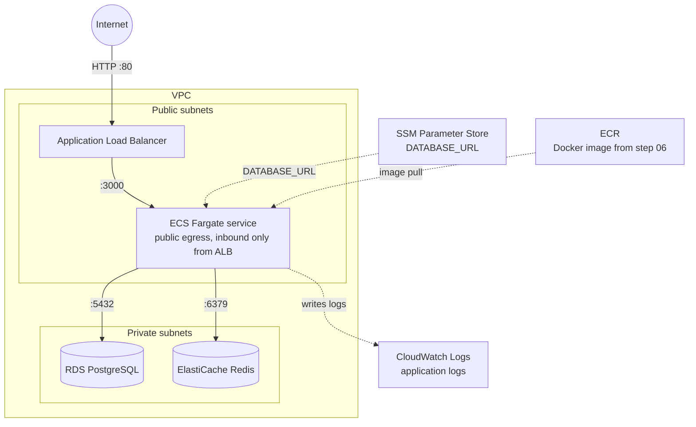

# 15 - Terraform Capstone: Mini Architecture

## Objective

In this capstone, you will create a real Terraform project in `./terraform` and use it to deploy a small AWS architecture.

You will also write:

- `terraform/README.md`: operations guide for daily commands.
- `terraform/RUNBOOK.md`: incident runbook for common failures.

The goal is not just "Terraform apply works". The goal is to understand how to build, operate, debug, and destroy a small infrastructure stack.

## Architecture



Why ECS is in public subnets for this lab:

- It keeps the capstone cheaper and easier.
- ECS can pull images from ECR and write logs without NAT Gateway or VPC endpoints.
- Inbound app traffic is still restricted to the ALB security group.

Production improvement later: move ECS to private subnets and add NAT Gateway or VPC endpoints for ECR, CloudWatch Logs, and S3.

## Prerequisites

- Completed [step 00](00-prerequisites.md): AWS CLI configured.
- Completed [step 06](06-ecr-image-registry.md): ECR image pushed.
- Completed [step 08](08-alb-public-entry.md): you understand ALB -> ECS.
- Terraform CLI installed:

```bash
terraform --version
```

Recommended: Terraform `1.5+`.

Check your ECR image exists:

```bash
aws ecr describe-images \
  --repository-name learn-devops-demo-node \
  --image-ids imageTag=demo-001
```

## Cost Warning

This lab creates paid AWS resources:

- RDS PostgreSQL
- ECS Fargate
- Application Load Balancer
- CloudWatch Logs

Destroy the stack when finished:

```bash
terraform destroy
```

## Terraform Folder

From the repo root:

```bash
mkdir -p terraform
cd terraform
```

Expected structure:

```text
terraform/
├── README.md
├── RUNBOOK.md
├── .gitignore
├── main.tf
├── variables.tf
├── vpc.tf
├── security-groups.tf
├── ecr.tf
├── iam.tf
├── rds.tf
├── elasticache.tf
├── ssm.tf
├── cloudwatch.tf
├── alb.tf
├── ecs.tf
├── outputs.tf
└── terraform.tfvars.example
```

## Provider Setup

File: `terraform/main.tf`

```hcl
terraform {
  required_version = ">= 1.5.0"

  required_providers {
    aws = {
      source  = "hashicorp/aws"
      version = "~> 5.0"
    }
  }
}

provider "aws" {
  region = var.aws_region

  default_tags {
    tags = {
      Project     = var.demo_prefix
      ManagedBy   = "Terraform"
      Environment = "learning"
    }
  }
}

data "aws_caller_identity" "current" {}
data "aws_region" "current" {}
```

## Variables

File: `terraform/variables.tf`

```hcl
variable "aws_region" {
  description = "AWS region for the lab."
  type        = string
  default     = "ap-southeast-1"
}

variable "demo_prefix" {
  description = "Prefix used for named AWS resources."
  type        = string
  default     = "learn-devops-demo"
}

variable "ecr_repository_name" {
  description = "Existing ECR repository name created in step 06."
  type        = string
  default     = "learn-devops-demo-node"
}

variable "image_tag" {
  description = "Container image tag to deploy from ECR."
  type        = string
  default     = "demo-001"
}

variable "app_port" {
  description = "Container port exposed by the Node.js app."
  type        = number
  default     = 3000
}

variable "desired_count" {
  description = "Number of ECS tasks to run."
  type        = number
  default     = 1
}

variable "container_cpu" {
  description = "Fargate CPU units. 256 is 0.25 vCPU."
  type        = number
  default     = 256
}

variable "container_memory" {
  description = "Fargate memory in MiB."
  type        = number
  default     = 512
}

variable "db_name" {
  description = "Initial PostgreSQL database name."
  type        = string
  default     = "devops_demo"
}

variable "db_username" {
  description = "PostgreSQL master username."
  type        = string
  default     = "devops_demo"
}

variable "db_password" {
  description = "PostgreSQL master password."
  type        = string
  sensitive   = true
}

variable "log_retention_days" {
  description = "CloudWatch log retention for ECS app logs."
  type        = number
  default     = 3
}
```

File: `terraform/terraform.tfvars.example`

```hcl
aws_region          = "ap-southeast-1"
demo_prefix         = "learn-devops-demo"
ecr_repository_name = "learn-devops-demo-node"
image_tag           = "demo-001"
db_password         = "ChangeMe12345!"
```

Create your private local copy:

```bash
cp terraform.tfvars.example terraform.tfvars
```

Then edit `terraform.tfvars` and choose your own `db_password`.

## Part 1: Networking

File: `terraform/vpc.tf`

```hcl
data "aws_availability_zones" "available" {
  state = "available"
}

locals {
  azs = slice(data.aws_availability_zones.available.names, 0, 2)
}

resource "aws_vpc" "main" {
  cidr_block           = "10.0.0.0/16"
  enable_dns_hostnames = true
  enable_dns_support   = true

  tags = {
    Name = "${var.demo_prefix}-vpc"
  }
}

resource "aws_internet_gateway" "main" {
  vpc_id = aws_vpc.main.id

  tags = {
    Name = "${var.demo_prefix}-igw"
  }
}

resource "aws_subnet" "public" {
  count = 2

  vpc_id                  = aws_vpc.main.id
  cidr_block              = cidrsubnet(aws_vpc.main.cidr_block, 8, count.index + 1)
  availability_zone       = local.azs[count.index]
  map_public_ip_on_launch = true

  tags = {
    Name = "${var.demo_prefix}-public-${count.index + 1}"
    Tier = "public"
  }
}

resource "aws_subnet" "private" {
  count = 2

  vpc_id            = aws_vpc.main.id
  cidr_block        = cidrsubnet(aws_vpc.main.cidr_block, 8, count.index + 11)
  availability_zone = local.azs[count.index]

  tags = {
    Name = "${var.demo_prefix}-private-${count.index + 1}"
    Tier = "private"
  }
}

resource "aws_route_table" "public" {
  vpc_id = aws_vpc.main.id

  route {
    cidr_block = "0.0.0.0/0"
    gateway_id = aws_internet_gateway.main.id
  }

  tags = {
    Name = "${var.demo_prefix}-public-rt"
  }
}

resource "aws_route_table_association" "public" {
  count = length(aws_subnet.public)

  subnet_id      = aws_subnet.public[count.index].id
  route_table_id = aws_route_table.public.id
}
```

Learning checkpoint:

- Public subnets have a route to the Internet Gateway.
- Private subnets do not.
- RDS will use private subnets.

## Part 2: Security Groups

File: `terraform/security-groups.tf`

```hcl
resource "aws_security_group" "alb" {
  name        = "${var.demo_prefix}-alb-sg"
  description = "Allow HTTP from the internet to the ALB."
  vpc_id      = aws_vpc.main.id

  ingress {
    description = "HTTP from internet"
    from_port   = 80
    to_port     = 80
    protocol    = "tcp"
    cidr_blocks = ["0.0.0.0/0"]
  }

  egress {
    description = "All outbound"
    from_port   = 0
    to_port     = 0
    protocol    = "-1"
    cidr_blocks = ["0.0.0.0/0"]
  }

  tags = {
    Name = "${var.demo_prefix}-alb-sg"
  }
}

resource "aws_security_group" "ecs" {
  name        = "${var.demo_prefix}-ecs-sg"
  description = "Allow app traffic from ALB to ECS tasks."
  vpc_id      = aws_vpc.main.id

  ingress {
    description     = "App traffic from ALB"
    from_port       = var.app_port
    to_port         = var.app_port
    protocol        = "tcp"
    security_groups = [aws_security_group.alb.id]
  }

  egress {
    description = "All outbound for ECR, CloudWatch Logs, and RDS"
    from_port   = 0
    to_port     = 0
    protocol    = "-1"
    cidr_blocks = ["0.0.0.0/0"]
  }

  tags = {
    Name = "${var.demo_prefix}-ecs-sg"
  }
}

resource "aws_security_group" "rds" {
  name        = "${var.demo_prefix}-rds-sg"
  description = "Allow PostgreSQL from ECS tasks only."
  vpc_id      = aws_vpc.main.id

  ingress {
    description     = "PostgreSQL from ECS"
    from_port       = 5432
    to_port         = 5432
    protocol        = "tcp"
    security_groups = [aws_security_group.ecs.id]
  }

  egress {
    description = "All outbound"
    from_port   = 0
    to_port     = 0
    protocol    = "-1"
    cidr_blocks = ["0.0.0.0/0"]
  }

  tags = {
    Name = "${var.demo_prefix}-rds-sg"
  }
}

resource "aws_security_group" "redis" {
  name        = "${var.demo_prefix}-redis-sg"
  description = "Allow Redis from ECS tasks only."
  vpc_id      = aws_vpc.main.id

  ingress {
    description     = "Redis from ECS"
    from_port       = 6379
    to_port         = 6379
    protocol        = "tcp"
    security_groups = [aws_security_group.ecs.id]
  }

  egress {
    description = "All outbound"
    from_port   = 0
    to_port     = 0
    protocol    = "-1"
    cidr_blocks = ["0.0.0.0/0"]
  }

  tags = {
    Name = "${var.demo_prefix}-redis-sg"
  }
}
```

Learning checkpoint:

- Internet can reach only the ALB on port `80`.
- ALB can reach ECS on port `3000`.
- ECS can reach RDS on port `5432` and Redis on port `6379`.

## Part 3: ECR Reference

File: `terraform/ecr.tf`

```hcl
data "aws_ecr_repository" "app" {
  name = var.ecr_repository_name
}
```

This uses the repository created in step 06. Terraform will not create or delete ECR in this capstone.

## Part 4: IAM Roles

File: `terraform/iam.tf`

```hcl
data "aws_iam_policy_document" "ecs_tasks_assume_role" {
  statement {
    actions = ["sts:AssumeRole"]

    principals {
      type        = "Service"
      identifiers = ["ecs-tasks.amazonaws.com"]
    }
  }
}

resource "aws_iam_role" "ecs_execution" {
  name               = "${var.demo_prefix}-ecs-execution-role"
  assume_role_policy = data.aws_iam_policy_document.ecs_tasks_assume_role.json

  tags = {
    Name = "${var.demo_prefix}-ecs-execution-role"
  }
}

resource "aws_iam_role_policy_attachment" "ecs_execution_managed" {
  role       = aws_iam_role.ecs_execution.name
  policy_arn = "arn:aws:iam::aws:policy/service-role/AmazonECSTaskExecutionRolePolicy"
}

resource "aws_iam_role_policy" "ecs_execution_ssm" {
  name = "${var.demo_prefix}-read-ssm"
  role = aws_iam_role.ecs_execution.id

  policy = jsonencode({
    Version = "2012-10-17"
    Statement = [
      {
        Effect = "Allow"
        Action = [
          "ssm:GetParameter",
          "ssm:GetParameters"
        ]
        Resource = aws_ssm_parameter.database_url.arn
      }
    ]
  })
}

resource "aws_iam_role" "ecs_task" {
  name               = "${var.demo_prefix}-ecs-task-role"
  assume_role_policy = data.aws_iam_policy_document.ecs_tasks_assume_role.json

  tags = {
    Name = "${var.demo_prefix}-ecs-task-role"
  }
}
```

Learning checkpoint:

- Execution role lets ECS pull image, write logs, and read secrets.
- Task role is for app AWS API access. This app does not need extra permissions yet.

## Part 5: RDS PostgreSQL

File: `terraform/rds.tf`

```hcl
resource "aws_db_subnet_group" "app" {
  name        = "${var.demo_prefix}-db-subnet-group"
  description = "Private subnets for the demo PostgreSQL database."
  subnet_ids  = aws_subnet.private[*].id

  tags = {
    Name = "${var.demo_prefix}-db-subnet-group"
  }
}

resource "aws_db_instance" "app" {
  identifier = "${var.demo_prefix}-postgres"

  engine         = "postgres"
  engine_version = "16"
  instance_class = "db.t4g.micro"

  allocated_storage = 20
  storage_type      = "gp3"

  db_name  = var.db_name
  username = var.db_username
  password = var.db_password

  db_subnet_group_name   = aws_db_subnet_group.app.name
  vpc_security_group_ids = [aws_security_group.rds.id]
  publicly_accessible    = false

  backup_retention_period = 0
  deletion_protection     = false
  skip_final_snapshot     = true

  tags = {
    Name = "${var.demo_prefix}-postgres"
  }
}
```

Learning checkpoint:

- `publicly_accessible = false` keeps the database private.
- `skip_final_snapshot = true` is convenient for a lab, not for production.
- `deletion_protection = false` makes cleanup easier for learning.

## Part 6: ElastiCache Redis

File: `terraform/elasticache.tf`

```hcl
resource "aws_elasticache_serverless_cache" "app" {
  engine = "redis"
  name   = "${var.demo_prefix}-redis"

  subnet_ids         = aws_subnet.private[*].id
  security_group_ids = [aws_security_group.redis.id]

  tags = {
    Name = "${var.demo_prefix}-redis"
  }
}
```

## Part 7: SSM Parameter

File: `terraform/ssm.tf`

```hcl
resource "aws_ssm_parameter" "database_url" {
  name  = "/${var.demo_prefix}/database-url"
  type  = "String"
  value = "postgres://${var.db_username}:${var.db_password}@${aws_db_instance.app.address}:${aws_db_instance.app.port}/${var.db_name}?sslmode=require"

  tags = {
    Name = "${var.demo_prefix}-database-url"
  }
}
```

Production note: use `SecureString` with KMS for real secrets. This lab uses `String` to keep the IAM/KMS setup simpler.

## Part 8: CloudWatch Logs

File: `terraform/cloudwatch.tf`

```hcl
resource "aws_cloudwatch_log_group" "app" {
  name              = "/ecs/${var.demo_prefix}"
  retention_in_days = var.log_retention_days

  tags = {
    Name = "${var.demo_prefix}-ecs-logs"
  }
}
```

## Part 9: Application Load Balancer

File: `terraform/alb.tf`

```hcl
resource "aws_lb" "app" {
  name               = "${var.demo_prefix}-alb"
  internal           = false
  load_balancer_type = "application"
  security_groups    = [aws_security_group.alb.id]
  subnets            = aws_subnet.public[*].id

  tags = {
    Name = "${var.demo_prefix}-alb"
  }
}

resource "aws_lb_target_group" "app" {
  name        = "${var.demo_prefix}-tg"
  port        = var.app_port
  protocol    = "HTTP"
  target_type = "ip"
  vpc_id      = aws_vpc.main.id

  health_check {
    enabled             = true
    path                = "/health"
    matcher             = "200"
    interval            = 30
    timeout             = 5
    healthy_threshold   = 2
    unhealthy_threshold = 3
  }

  tags = {
    Name = "${var.demo_prefix}-tg"
  }
}

resource "aws_lb_listener" "http" {
  load_balancer_arn = aws_lb.app.arn
  port              = 80
  protocol          = "HTTP"

  default_action {
    type             = "forward"
    target_group_arn = aws_lb_target_group.app.arn
  }
}
```

## Part 10: ECS Fargate

File: `terraform/ecs.tf`

```hcl
resource "aws_ecs_cluster" "app" {
  name = "${var.demo_prefix}-cluster"

  tags = {
    Name = "${var.demo_prefix}-cluster"
  }
}

resource "aws_ecs_task_definition" "app" {
  family                   = "${var.demo_prefix}-task"
  network_mode             = "awsvpc"
  requires_compatibilities = ["FARGATE"]
  cpu                      = var.container_cpu
  memory                   = var.container_memory
  execution_role_arn       = aws_iam_role.ecs_execution.arn
  task_role_arn            = aws_iam_role.ecs_task.arn

  container_definitions = jsonencode([
    {
      name      = "app"
      image     = "${data.aws_ecr_repository.app.repository_url}:${var.image_tag}"
      essential = true
      portMappings = [
        {
          containerPort = var.app_port
          hostPort      = var.app_port
          protocol      = "tcp"
        }
      ]
      environment = [
        {
          name  = "PORT"
          value = tostring(var.app_port)
        },
        {
          name  = "HOST"
          value = "0.0.0.0"
        },
        {
          name  = "ECS_SERVICE_NAME"
          value = "${var.demo_prefix}-service"
        },
        {
          name  = "REDIS_HOST"
          value = aws_elasticache_serverless_cache.app.endpoint[0].address
        },
        {
          name  = "DEMO_REDIS_STATUS"
          value = "ok"
        }
      ]
      secrets = [
        {
          name      = "DATABASE_URL"
          valueFrom = aws_ssm_parameter.database_url.arn
        }
      ]
      logConfiguration = {
        logDriver = "awslogs"
        options = {
          awslogs-group         = aws_cloudwatch_log_group.app.name
          awslogs-region        = var.aws_region
          awslogs-stream-prefix = "app"
        }
      }
    }
  ])

  tags = {
    Name = "${var.demo_prefix}-task"
  }

  depends_on = [
    aws_iam_role_policy_attachment.ecs_execution_managed,
    aws_iam_role_policy.ecs_execution_ssm
  ]
}

resource "aws_ecs_service" "app" {
  name            = "${var.demo_prefix}-service"
  cluster         = aws_ecs_cluster.app.id
  task_definition = aws_ecs_task_definition.app.arn
  desired_count   = var.desired_count
  launch_type     = "FARGATE"

  network_configuration {
    subnets          = aws_subnet.public[*].id
    security_groups  = [aws_security_group.ecs.id]
    assign_public_ip = true
  }

  load_balancer {
    target_group_arn = aws_lb_target_group.app.arn
    container_name   = "app"
    container_port   = var.app_port
  }

  depends_on = [aws_lb_listener.http]

  tags = {
    Name = "${var.demo_prefix}-service"
  }
}
```

## Part 11: Outputs

File: `terraform/outputs.tf`

```hcl
output "alb_url" {
  description = "Public URL for the demo app."
  value       = "http://${aws_lb.app.dns_name}"
}

output "cluster_name" {
  description = "ECS cluster name."
  value       = aws_ecs_cluster.app.name
}

output "service_name" {
  description = "ECS service name."
  value       = aws_ecs_service.app.name
}

output "target_group_arn" {
  description = "ALB target group ARN for health checks."
  value       = aws_lb_target_group.app.arn
}

output "log_group_name" {
  description = "CloudWatch log group for app logs."
  value       = aws_cloudwatch_log_group.app.name
}

output "rds_endpoint" {
  description = "Private RDS endpoint."
  value       = aws_db_instance.app.address
}

output "database_url_parameter_name" {
  description = "SSM parameter name used by the ECS task."
  value       = aws_ssm_parameter.database_url.name
}

output "redis_endpoint" {
  description = "Private Redis endpoint."
  value       = aws_elasticache_serverless_cache.app.endpoint[0].address
}
```


## Run Terraform

From `terraform/`:

```bash
terraform init
terraform fmt
terraform validate
terraform plan
```

Read the plan carefully:

- `+` means Terraform will create a resource.
- `~` means Terraform will update a resource.
- `-` means Terraform will destroy a resource.

Apply:

```bash
terraform apply
```

Type `yes` when prompted.

RDS and ECS can take several minutes.

## Verify the Deployment

```bash
terraform output
ALB_URL=$(terraform output -raw alb_url)
echo "$ALB_URL"
```

Test endpoints:

```bash
curl -i "$ALB_URL/health"
curl -i "$ALB_URL/flow"
curl -i "$ALB_URL/api/db/health"
curl -i "$ALB_URL/test-error"
```

Expected:

- `/health` -> HTTP `200`
- `/flow` -> HTTP `200`
- `/api/db/health` -> HTTP `200` when RDS is reachable
- `/test-error` -> HTTP `500` intentionally

Check state:

```bash
terraform state list
terraform state show aws_ecs_service.app
```

Check logs:

```bash
aws logs tail "$(terraform output -raw log_group_name)" --since 10m
```

## Practice Operations

Scale to 2 tasks:

```bash
terraform apply -var="desired_count=2"
```

Check ECS:

```bash
aws ecs describe-services \
  --cluster "$(terraform output -raw cluster_name)" \
  --services "$(terraform output -raw service_name)" \
  --query 'services[0].{desired:desiredCount,running:runningCount,pending:pendingCount}'
```

Scale back to 1:

```bash
terraform apply -var="desired_count=1"
```

Practice a safe incident:

```bash
curl -i "$(terraform output -raw alb_url)/test-error"
aws logs tail "$(terraform output -raw log_group_name)" --since 5m
```

## Destroy Everything

When done:

```bash
terraform destroy
```

Type `yes`.

Verify:

```bash
terraform state list
```

If resources remain, use [step 13](13-cleanup-cost-control.md).

## Troubleshooting

| Problem | Likely Cause | Fix |
| --- | --- | --- |
| `terraform init` fails | Provider download/network issue | Check internet, retry |
| ECR repo not found | Step 06 not completed or wrong repo name | Check `ecr_repository_name` |
| Image tag not found | Wrong `image_tag` | Run `aws ecr describe-images` |
| RDS password rejected | Password too short/simple | Use 8+ chars with letters, numbers, symbol |
| ECS task cannot start | Bad image, SSM/IAM issue, app crash | Check ECS events and logs |
| ALB returns 503 | No healthy targets | Check target health |
| `/api/db/health` fails | DB not ready or SG/secret issue | Check RDS, logs, SSM parameter |
| `terraform destroy` takes long | RDS or ALB deletion | Wait and check AWS Console |

## Terraform vs CloudFormation

| Feature | CloudFormation | Terraform |
| --- | --- | --- |
| Language | YAML / JSON | HCL |
| State | Managed by AWS | Managed by Terraform |
| Preview | Change Sets | `terraform plan` |
| Provider ecosystem | AWS-focused | AWS, GCP, Azure, SaaS providers |
| Drift check | CloudFormation drift detection | `terraform plan` |
| Delete | Delete stack | `terraform destroy` |

## Expected Result

By the end, you should have created:

- `terraform/` code for a mini AWS architecture.
- `terraform/README.md` for normal operations.
- `terraform/RUNBOOK.md` for incident response.
- A working ALB URL.
- ECS app logs in CloudWatch.
- A private RDS database reachable from the app.
- Confidence using `init`, `fmt`, `validate`, `plan`, `apply`, `output`, `state`, and `destroy`.

---

**Previous**: [Step 14 - CloudFormation](14-cloudformation.md)

**Cleanup**: [Step 13 - Cleanup and Cost Control](13-cleanup-cost-control.md)
