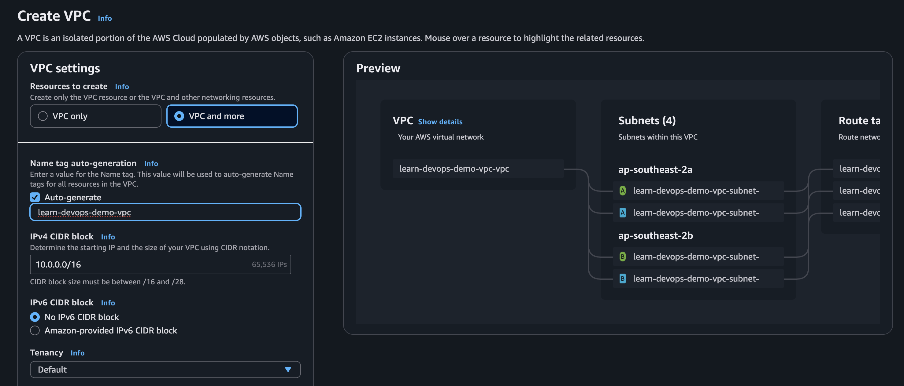

# Tạo VPC bằng AWS Console

Hướng dẫn này dùng wizard `VPC and more` để tạo network cho bài [04 - VPC Network](../04-vpc-network.md).

## Kết quả cần tạo

```text
learn-devops-demo-vpc: 10.0.0.0/16
├── Public subnet A:  10.0.1.0/24
├── Public subnet B:  10.0.2.0/24
├── Private subnet A: 10.0.11.0/24
└── Private subnet B: 10.0.12.0/24
```

Public subnet sẽ dành cho ALB. Private subnet sẽ dành cho ECS task và RDS.

Wizard tự sinh Name tag cho subnet, thường kèm loại subnet và Availability Zone. Trong bài này, hãy dùng CIDR để nhận diện chính xác từng subnet. Sau khi tạo xong, bạn có thể đổi Name tag thành `learn-devops-demo-public-a`, `learn-devops-demo-public-b`, `learn-devops-demo-private-a` và `learn-devops-demo-private-b` để dễ theo dõi.

## Mở màn hình tạo VPC

1. Đăng nhập AWS Console.
2. Tìm service `VPC`.
3. Vào `Your VPCs`.
4. Nhấn `Create VPC`.

Màn hình cần điền:



## Điền VPC settings


| Field                      | Giá trị cần chọn hoặc nhập                        | Giải thích                                                    |
| -------------------------- | ------------------------------------------------- | ------------------------------------------------------------- |
| `Resources to create`      | `VPC and more`                                    | AWS tạo VPC và các thành phần network cơ bản trong một lần.   |
| `Name tag auto-generation` | Bật `Auto-generate`, nhập `learn-devops-demo`     | AWS tự tạo Name tag cho VPC, subnet và route table.           |
| `IPv4 CIDR block`          | `10.0.0.0/16`                                     | Dải IP private tổng của VPC. Các subnet sẽ lấy IP từ dải này. |
| `IPv6 CIDR block`          | `No IPv6 CIDR block`                              | Lab này chưa dùng IPv6.                                       |
| `Tenancy`                  | `Default`                                         | Dùng cấu hình thông thường. Không cần dedicated hardware.     |
| `Encryption settings`      | Giữ mặc định                                      | Lab này chưa cần thay đổi.                                    |


## Điền subnet settings


| Field                                | Giá trị cần chọn | Giải thích                                             |
| ------------------------------------ | ---------------- | ------------------------------------------------------ |
| `Number of Availability Zones (AZs)` | `2`              | Tạo subnet ở hai AZ khác nhau để chuẩn bị cho ALB.     |
| `Customize AZs`                      | Giữ mặc định     | AWS tự chọn hai AZ trong region hiện tại.              |
| `Number of public subnets`           | `2`              | Mỗi AZ có một public subnet dành cho ALB.              |
| `Number of private subnets`          | `2`              | Mỗi AZ có một private subnet dành cho ECS task và RDS. |


Có thể giữ CIDR mặc định do AWS tự sinh. ALB, ECS và RDS vẫn hoạt động bình thường nếu có đủ 2 public subnet, 2 private subnet và các CIDR không trùng nhau.

Nếu muốn CIDR dễ đọc và dễ đối chiếu khi debug, mở `Customize subnets CIDR blocks`, sau đó điền:


| Field                                   | CIDR           |
| --------------------------------------- | -------------- |
| Public subnet CIDR block ở AZ thứ nhất  | `10.0.1.0/24`  |
| Public subnet CIDR block ở AZ thứ hai   | `10.0.2.0/24`  |
| Private subnet CIDR block ở AZ thứ nhất | `10.0.11.0/24` |
| Private subnet CIDR block ở AZ thứ hai  | `10.0.12.0/24` |


Tên AZ cụ thể có thể khác nhau tùy region, ví dụ `ap-southeast-1a` và `ap-southeast-1b`. Điều quan trọng là có hai AZ khác nhau.

## Điền gateway và DNS settings


| Field                   | Giá trị cần chọn | Giải thích                                                                                   |
| ----------------------- | ---------------- | -------------------------------------------------------------------------------------------- |
| `NAT gateways ($)`      | `None`           | Không phát sinh phí NAT Gateway. Private subnet chưa cần tự truy cập Internet trong lab này. |
| `VPC endpoints`         | `None`           | Chưa cần dùng ở bước này.                                                                    |
| `Enable DNS hostnames`  | Bật              | Cho phép resource trong VPC sử dụng DNS hostname khi cần.                                    |
| `Enable DNS resolution` | Bật              | Cho phép phân giải DNS trong VPC.                                                            |


Nhấn `Create VPC` và chờ đến khi AWS báo hoàn tất.

## Kiểm tra sau khi tạo

Vào `Your VPCs`, chọn VPC vừa tạo và xác nhận Name tag là `learn-devops-demo-vpc`.

Vào `Subnets`, lọc theo VPC vừa tạo và xác nhận:

- Có `2` public subnet.
- Có `2` private subnet.
- Bốn subnet thuộc đúng hai AZ khác nhau.
- CIDR của bốn subnet không trùng nhau và đều thuộc VPC `10.0.0.0/16`.
- Nếu đã customize CIDR, bốn subnet khớp với bảng phía trên.

Vào `Route tables` và xác nhận:

- Public route table có route `0.0.0.0/0` trỏ đến Internet Gateway (`igw-...`).
- Private route table chỉ cần local route ở bước này.

## Lưu ý về NAT Gateway

Chỉ tạo NAT Gateway khi resource trong private subnet cần chủ động kết nối ra Internet, ví dụ tải package hoặc gọi API bên ngoài. NAT Gateway có phí theo thời gian sử dụng và lượng data xử lý, nên không tạo trong lab tối giản.
