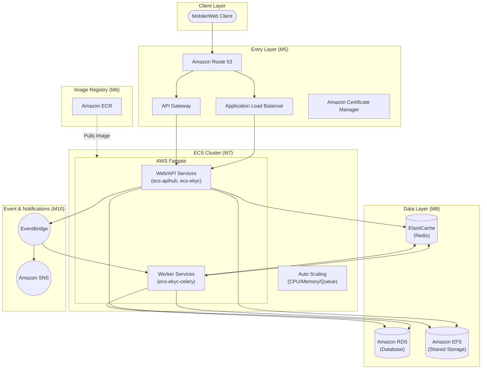

**AWS DevOps Learning Roadmap**

*From Mobile Software Engineer → DevOps Engineer for ECS/Fargate, ECR, ALB, RDS, Redis, EFS, EventBridge, SNS, CloudFormation*

Objective: Learn module by module, with detailed learning links, hands-on labs, and production operations checklists.

*Reference architecture: AWS system using ECR → ECS services → data layer → autoscaling/event/notification.*

# **1\. How to use this guide**

* Read in module order. Each module has objectives, required knowledge, hands-on labs, and detailed documentation links.
* Prioritize hands-on practice after reading. DevOps is an operational skill; don't just learn theory.
* For an architecture similar to the diagram, the focus is on AWS networking, Docker/ECR, ECS/Fargate, ALB/API Gateway, RDS/Redis/EFS, CloudFormation, CI/CD, observability, and security.
* When practicing on a real AWS account, use a sandbox/dev environment first. Avoid direct production operations until you understand the impact.

| Important Warning for Network/Production |
| :---- |
| Operations like changing Security Groups, Route Tables, NAT Gateways, ALB listeners, DNS records, certificates, or subnet associations can cause traffic drops, loss of SSH/SSM access, API downtime, or client connection failures. Always review change sets, backup current configurations, and have a rollback plan before applying to production. |

# **2\. Mapping the architecture to required skills**

| Build Order | Architecture Component | AWS Service | What you need to learn | Module |
| :---- | :---- | :---- | :---- | :---- |
| 1 | Image Registry | Amazon ECR | Docker images, tagging, push/pull, lifecycle policies, permissions | M2, M6 |
| 2 | Core Network & Entry | VPC, ACM, ALB, API Gateway, Route 53 | TLS, DNS, listeners, target groups, path/host routing, API routes | M4, M5 |
| 3 | ECS Cluster & Services | Amazon ECS/Fargate | clusters, task definitions, services, logs, health checks, deployments, exec | M7 |
| 4 | Data Layer | RDS, ElastiCache Redis, EFS | backup/restore, connections, private networking, mounts, performance | M8 |
| 5 | Auto Scaling | ECS Service Auto Scaling, Application Auto Scaling | CPU/memory/request/queue scaling, cooldowns, min/max tasks | M9 |
| 6 | Event/Notifications | EventBridge, SNS | schedules/event rules, targets, topics, subscriptions, alerting | M10 |
| 7 | Independent Services | EC2, EFS transfer, Samba | SSH/SSM, AMI, EBS, hardening, backups, patching | M4, M14 |
| All | IaC / Build Order | CloudFormation | templates, stacks, nested stacks, outputs, rollbacks, change sets | M11 |
| All | Deploy & Operate | CI/CD, CloudWatch, CloudTrail, Secrets, KMS | pipelines, logs, alarms, secrets, encryption, audits | M12, M13, M14 |

# **3\. Proposed Roadmap**

| No | Module | Objective | Deliverable | Priority |
| :---- | :---- | :---- | :---- | :---- |
| 1 | M0 Linux/Git | Confidently operate the terminal, logs, services, processes, and Git branches | Command cheatsheet \+ debug a local service | Mandatory |
| 2 | M1 Network/Web | Understand HTTP, DNS, TLS, ports, subnets, and routing | Diagram request flows from a mobile app to an API | Mandatory |
| 3 | M2 Docker | Dockerize apps, understand images/containers/volumes/networks | Dockerfile \+ docker compose running locally | Mandatory |
| 4 | M3 IAM/AWS CLI | Configure AWS CLI, IAM roles/policies, and least privilege | Create safe lab IAM roles/policies | Mandatory |
| 5 | M4 VPC/EC2 | Build public/private VPCs, NAT, SGs, and EC2 | Private EC2 access via SSM/SSH \+ network diagram | Mandatory |
| 6 | M5 Entry Layer | ALB, ACM, Route53, and API Gateway | HTTPS domain → ALB → health check OK | Mandatory |
| 7 | M6-M7 ECR/ECS | Push images to ECR, deploy ECS Fargate services | ECS service behind ALB, rolling deploy OK | Mandatory |
| 8 | M8 Data Layer | RDS, Redis, and private EFS access | ECS app connects to RDS/Redis, mounts EFS | Mandatory |
| 9 | M9 Scaling | ECS Service Auto Scaling | Scaling policies based on CPU/memory/requests | Important |
| 10 | M10 Event/SNS | Scheduled jobs, event rules, and notifications | EventBridge schedule → SNS/email or ECS task | Important |
| 11 | M11 CloudFormation | Build IaC following proper build order | Nested stack for a mini architecture | Mandatory |
| 12 | M12 CI/CD | Build images, push to ECR, update ECS | Automated GitHub Actions/CodePipeline deployments | Mandatory |
| 13 | M13 Observability | Logs, metrics, alarms, dashboards, and audits | CloudWatch dashboard \+ alarms \+ CloudTrail checks | Mandatory |
| 14 | M14 Security/DR/Cost | Hardening, backups, incident response, and costs | Rollback runbooks \+ backup restore drills | Mandatory |

# **4\. Detailed Learning Modules**

## **M0. Linux, Terminal, Git, and Server Operations Mindset**

**Objective:** You must be able to operate a server, read logs, understand processes/services, permissions, SSH/SSM, and use Git proficiently before diving deep into AWS.

Required Learning:

* Linux file system, permissions, users/groups, processes, ports, disk, memory.
* systemd/services, journalctl, log files, cron, environment variables.
* SSH keys, known\_hosts, authorized\_keys, basic hardening.
* Git branches, merge/rebase, tags, rollback commits, release branches.

Recommended Hands-on Labs:

1. Install an Ubuntu VM or use a small EC2 instance; practice commands: ls, cd, grep, find, tail, systemctl, journalctl, ss/netstat, df, du, top/htop.
2. Create a systemd service running a demo Node/Rails/Python app and read logs when the service fails.
3. Create a demo Git repo, build a release flow: feature branch → PR → merge → tag.

Detailed Links:

* [Ubuntu command line for beginners](https://documentation.ubuntu.com/desktop/en/latest/tutorial/the-linux-command-line-for-beginners/)
* [Ubuntu Server documentation](https://ubuntu.com/server/docs/)
* [Pro Git book](https://git-scm.com/book/en/v2)

## **M1. Networking, HTTP, DNS, and TLS**

**Objective:** The most frequent AWS DevOps errors occur in networking. You must understand request paths, DNS resolution, TLS certificates, firewall rules, timeouts, and health checks.

Required Learning:

* HTTP request/response, status codes, headers, timeouts, CORS basics.
* DNS A/CNAME/alias records, propagation, TTL, split-horizon DNS concepts.
* TLS/HTTPS, certificates, chains, domain validation.
* Ports, protocols, CIDR, subnets, public/private networks, routing.

Recommended Hands-on Labs:

4. Diagram flow: Mobile app → DNS → ALB/API Gateway → ECS → RDS/Redis/EFS.
5. Use curl to check statuses/headers/timeouts; use dig/nslookup to check DNS.
6. Use openssl s\_client or browser devtools to verify certificates.

| Production Warning |
| :---- |
| Changing DNS, certificates, ALB listeners, or routes can break user access. Reduce TTL before DNS migration, test with subdomains, and have a rollback record ready. |

Detailed Links:

* [MDN: Overview of HTTP](https://developer.mozilla.org/en-US/docs/Web/HTTP/Guides/Overview)
* [Cloudflare: What is DNS?](https://www.cloudflare.com/learning/dns/what-is-dns/)
* [MDN: Transport Layer Security](https://developer.mozilla.org/en-US/docs/Web/Security/Defenses/Transport_Layer_Security)
* [AWS VPC overview](https://docs.aws.amazon.com/vpc/latest/userguide/what-is-amazon-vpc.html)

## **M2. Docker and Containerization**

**Objective:** ECS runs containers, making Docker a mandatory foundation. You must build clean, small images with health checks that run identically across local/CI/production environments.

Required Learning:

* Dockerfiles, image layers, multi-stage builds, tags/versions, .dockerignore.
* Container runtime, env vars, ports, volumes, networks, stdout/stderr logs.
* Docker Compose for local dev including app \+ postgres \+ redis.
* Image security basics: non-root users, pinning base images, scanning vulnerabilities.

Recommended Hands-on Labs:

7. Dockerize a demo API.
8. Create a docker-compose setup with a web app \+ postgres \+ redis.
9. Optimize an image using multi-stage builds, comparing before/after sizes.

Detailed Links:

* [Docker docs: Get started](https://docs.docker.com/get-started/)
* [Docker docs: Writing a Dockerfile](https://docs.docker.com/get-started/docker-concepts/building-images/writing-a-dockerfile/)

## **M3. AWS Account, AWS CLI, and IAM**

**Objective:** Before deploying, you must understand identities, permissions, and CLI operations. Improper IAM can cause data breaches or pipeline/deployment failures.

Required Learning:

* AWS account baselines, MFA, root user best practices.
* AWS CLI install/config/profiles/regions/outputs.
* IAM users, groups, roles, policies, trust policies, permission policies.
* Least privilege, temporary credentials, ECS task roles vs execution roles.

Recommended Hands-on Labs:

10. Install AWS CLI, create a dev profile, run `aws sts get-caller-identity`.
11. Create a read-only IAM policy for a service, test access denied when calling unauthorized endpoints.
12. Distinguish between the ECS execution role (used to pull images/logs) and the task role (used for app access to AWS services).

| Production Warning |
| :---- |
| Never use root access keys. Do not commit access keys to Git. If a key is leaked, rotate it immediately and check CloudTrail. |

Detailed Links:

* [AWS CLI getting started](https://docs.aws.amazon.com/cli/latest/userguide/cli-chap-getting-started.html)
* [AWS CLI install/update](https://docs.aws.amazon.com/cli/latest/userguide/getting-started-install.html)
* [IAM introduction](https://docs.aws.amazon.com/IAM/latest/UserGuide/introduction.html)
* [IAM least privilege](https://docs.aws.amazon.com/IAM/latest/UserGuide/getting-started-reduce-permissions.html)
* [IAM roles](https://docs.aws.amazon.com/IAM/latest/UserGuide/id_roles.html)

## **M4. VPC, Subnets, Security Groups, NAT Gateways, and EC2**

**Objective:** This is the backbone of the system. ECS, RDS, Redis, and EFS all run in VPCs/private subnets, so you must understand routing and firewalls.

Required Learning:

* VPC CIDR, public/private subnets, Availability Zones.
* Internet Gateways, NAT Gateways, route tables, route propagation.
* Security Group stateful firewalls, NACL concepts.
* EC2, SSH/SSM, key pairs, EBS, AMIs, Elastic IPs, CloudWatch Agent.
* Private access patterns: ECS → RDS/Redis/EFS without public exposure.

Recommended Hands-on Labs:

13. Build a 2-AZ VPC: public subnets for ALB/NAT, private subnets for ECS/RDS.
14. Launch a test EC2, verify outbound internet via NAT from the private subnet.
15. Create SGs: ALB allows only 80/443 public, ECS only accepts from ALB SG, RDS only accepts from ECS SG.

| Production Warning |
| :---- |
| Changing route tables, NAT Gateways, Security Groups, or subnet associations can cut off outbound internet for private services, drop SSH/SSM access, or disconnect apps from databases/caches. |

Detailed Links:

* [AWS VPC: What is Amazon VPC?](https://docs.aws.amazon.com/vpc/latest/userguide/what-is-amazon-vpc.html)
* [AWS VPC: Plan your VPC](https://docs.aws.amazon.com/vpc/latest/userguide/vpc-getting-started.html)
* [AWS VPC: Route tables](https://docs.aws.amazon.com/vpc/latest/userguide/VPC_Route_Tables.html)
* [AWS VPC: Security groups](https://docs.aws.amazon.com/vpc/latest/userguide/vpc-security-groups.html)
* [AWS VPC: NAT gateways](https://docs.aws.amazon.com/vpc/latest/userguide/vpc-nat-gateway.html)
* [EC2 getting started](https://docs.aws.amazon.com/AWSEC2/latest/UserGuide/EC2_GetStarted.html)

## **M5. Entry Layer: ALB, ACM, Route 53, and API Gateway**

**Objective:** The architecture features ACM, ALB, and API Gateway. You must know how user traffic enters the system, where TLS terminates, and how traffic is routed to ECS services.

Required Learning:

* ACM public certificates, DNS validation, renewals.
* ALB listeners, target groups, health checks, path/host-based routing.
* Route 53 hosted zones, A/AAAA Aliases, CNAMEs, DNS TTLs.
* API Gateway REST/HTTP APIs, custom domains, integrations, throttling, logging.

Recommended Hands-on Labs:

16. Request an ACM certificate using DNS validation.
17. Create an ALB HTTPS listener and target group for a demo ECS/EC2.
18. Create a Route 53 alias record pointing a domain/subdomain to the ALB.
19. Create an API Gateway route `/health` proxying to a backend demo.

| Production Warning |
| :---- |
| Incorrect health check paths or target group ports can cause ECS services to stay unhealthy. Incorrect DNS/certificates can cause HTTPS errors or prevent client apps from calling the API. |

Detailed Links:

* [Application Load Balancer introduction](https://docs.aws.amazon.com/elasticloadbalancing/latest/application/introduction.html)
* [Create an Application Load Balancer](https://docs.aws.amazon.com/elasticloadbalancing/latest/application/create-application-load-balancer.html)
* [ACM getting started](https://docs.aws.amazon.com/acm/latest/userguide/gs.html)
* [ACM DNS validation](https://docs.aws.amazon.com/acm/latest/userguide/dns-validation.html)
* [API Gateway developer guide](https://docs.aws.amazon.com/apigateway/latest/developerguide/welcome.html)
* [Route 53 getting started](https://docs.aws.amazon.com/Route53/latest/DeveloperGuide/getting-started.html)

## **M6. Amazon ECR \- Image Registry**

**Objective:** ECR stores Docker images for ECS to pull during deployment. This is the first step in the architecture's build order.

Required Learning:

* Repositories, image tags, digests, immutable tag strategies.
* ECR login via AWS CLI, docker tag/push/pull.
* Lifecycle policies to delete old images.
* Repository policies, IAM permissions, image scanning.

Recommended Hands-on Labs:

20. Build an image locally and push to ECR.
21. Create tags based on commit SHAs and `latest`.
22. Configure lifecycle policies to keep the last 20 versions or based on environments.

Detailed Links:

* [Amazon ECR getting started](https://docs.aws.amazon.com/AmazonECR/latest/userguide/example_ecr_GettingStarted_078_section.html)
* [Amazon ECR overview / getting started page](https://aws.amazon.com/ecr/getting-started/)

## **M7. Amazon ECS/Fargate \- Clusters, Task Definitions, Services**

**Objective:** This is the core runtime in the architecture. You will deploy multiple services like web/APIs and workers such as ecs-ekyc, ecs-ekyc-celery, ecs-apihub-celery.

Required Learning:

* Clusters, capacity providers, Fargate vs EC2 launch types.
* Task Definitions: containers, CPU/memory, port mapping, envs, secrets, logs, health checks.
* ECS Services: desired counts, deployment configurations, target groups, service discovery.
* Web services vs worker services; rolling deployments; ECS Exec; task restarts/debugging.
* Task roles vs execution roles; CloudWatch logs.

Recommended Hands-on Labs:

23. Deploy a web Fargate service behind an ALB.
24. Deploy a worker service with no public endpoints.
25. Debug failing tasks using stopped reasons, CloudWatch logs, and ECS Exec.
26. Practice updating image tags and rolling back to previous revisions.

| Production Warning |
| :---- |
| Do not arbitrarily increase desired counts or CPU/memory on production, as costs can spike rapidly. When updating task definitions, verify envs/secrets/ports/log groups prior to deployment. |

Detailed Links:

* [What is Amazon ECS?](https://docs.aws.amazon.com/AmazonECS/latest/developerguide/Welcome.html)
* [ECS getting started](https://docs.aws.amazon.com/AmazonECS/latest/developerguide/getting-started.html)
* [AWS Fargate for Amazon ECS](https://docs.aws.amazon.com/AmazonECS/latest/developerguide/AWS_Fargate.html)
* [Getting started with Amazon ECS page](https://aws.amazon.com/ecs/getting-started/)

## **M8. Data Layer: RDS, ElastiCache Redis, and EFS**

**Objective:** The architecture includes an RDS database (with retain templates), Redis, and EFS shared storage. DevOps must secure data, manage backups, enable private access, and ensure performance.

Required Learning:

* RDS instances, subnet groups, parameter groups, backups, snapshots, restores, Multi-AZ, connection pooling.
* Redis/ElastiCache: cache/session/queue brokers, memory, evictions, security groups, persistence/backups.
* EFS: file systems, mount targets, access points, NFS port 2049, permissions, backups.
* Private connectivity from ECS tasks to data services.

Recommended Hands-on Labs:

27. Create a dev RDS, connect from an ECS/EC2 private network, and try backing up/restoring snapshots.
28. Create a dev Redis, test app cache/session/queue connections.
29. Mount EFS onto an ECS task or EC2, test read/write permissions.
30. Create a backup retention checklist and conduct a restore drill.

| Production Warning |
| :---- |
| Do not expose RDS/Redis to the internet. Before changing SGs, parameter groups, or maintenance windows, review impacts on connections and potential downtime. Always test restores, not just creating backups. |

Detailed Links:

* [RDS getting started](https://docs.aws.amazon.com/AmazonRDS/latest/UserGuide/CHAP_GettingStarted.html)
* [What is Amazon RDS?](https://docs.aws.amazon.com/AmazonRDS/latest/UserGuide/Welcome.html)
* [ElastiCache getting started](https://docs.aws.amazon.com/AmazonElastiCache/latest/dg/GettingStarted.html)
* [EFS getting started](https://docs.aws.amazon.com/efs/latest/ug/getting-started.html)
* [What is Amazon EFS?](https://docs.aws.amazon.com/efs/latest/ug/whatisefs.html)

## **M9. Auto Scaling for ECS Services**

**Objective:** Auto Scaling allows the system to handle loads better, but you must understand metrics and cooldowns to prevent incorrect scaling or cost spikes.

Required Learning:

* ECS desired counts, min/max tasks.
* Target tracking, step scaling, scheduled scaling.
* Metrics: CPU, memory, ALB request counts, custom queue lengths.
* Cooldowns, scale-in protection, worker scaling based on queue depths.

Recommended Hands-on Labs:

31. Create an ECS service auto scaling policy based on CPU at 60-70%.
32. Create alarms/metrics for memory and request counts.
33. Perform light load testing to observe scale out/in.
34. Design worker scaling based on queue lengths on paper if custom metrics are unavailable.

| Production Warning |
| :---- |
| Incorrect scaling policies can spawn too many tasks, raising costs, or scale-in too quickly, wiping out capacity. For workers, handle graceful shutdowns to prevent job loss. |

Detailed Links:

* [ECS Service Auto Scaling](https://docs.aws.amazon.com/AmazonECS/latest/developerguide/service-auto-scaling.html)
* [Application Auto Scaling overview](https://docs.aws.amazon.com/autoscaling/application/userguide/what-is-application-auto-scaling.html)

## **M10. EventBridge and SNS**

**Objective:** The architecture uses EventBridge for events/domain calls and SNS for notifications. This is critical for automation and alerting.

Required Learning:

* EventBridge rules, event buses, schedules, targets, input transformers.
* SNS topics, subscriptions, fan-out, email/webhook/Lambda/SQS targets.
* Alert routing: CloudWatch Alarms → SNS, EventBridge events → SNS.
* Scheduled ECS tasks / periodic jobs.

Recommended Hands-on Labs:

35. Create an EventBridge schedule that runs daily and sends an SNS email.
36. Create a rule to catch a simple AWS event and publish it to SNS.
37. Design a flow: app event → EventBridge → downstream worker.

Detailed Links:

* [What is EventBridge?](https://docs.aws.amazon.com/eventbridge/latest/userguide/eb-what-is.html)
* [EventBridge tutorials](https://docs.aws.amazon.com/eventbridge/latest/userguide/eb-tutorial.html)
* [SNS getting started](https://docs.aws.amazon.com/sns/latest/dg/sns-getting-started.html)
* [What is Amazon SNS?](https://docs.aws.amazon.com/sns/latest/dg/welcome.html)

## **M11. CloudFormation \- Infrastructure as Code**

**Objective:** The architecture is built using CloudFormation. You need to provision stacks in the proper order, use parameters/outputs/imports, and understand rollbacks.

Required Learning:

* Template YAML, Resources, Parameters, Mappings, Conditions, Outputs.
* Stack creates/updates/deletes, change sets, drift detection.
* Nested stacks: network, data, ECS services, autoscaling, events.
* Export/ImportValues, DependsOn, retain policies, deletion policies.
* Rollback debugging and safe changes.

Recommended Hands-on Labs:

38. Write a template to create an ECR repository.
39. Write a network stack creating VPCs/subnets/SGs outputs.
40. Write an ECS service stack utilizing ImageUri/ClusterName/TargetGroupArn inputs.
41. Create a nested root stack simulating the architecture's build order.

| Production Warning |
| :---- |
| Updating CloudFormation on production may replace resources if properties change. Always view Change Sets prior to execution, especially for RDS/EFS/ALB/VPC resources. Use DeletionPolicy Retain for the data layer where appropriate. |

Detailed Links:

* [CloudFormation getting started](https://docs.aws.amazon.com/AWSCloudFormation/latest/UserGuide/GettingStarted.html)
* [What is CloudFormation?](https://docs.aws.amazon.com/AWSCloudFormation/latest/UserGuide/Welcome.html)
* [Template sections/anatomy](https://docs.aws.amazon.com/AWSCloudFormation/latest/UserGuide/template-anatomy.html)
* [Nested stacks](https://docs.aws.amazon.com/AWSCloudFormation/latest/UserGuide/using-cfn-nested-stacks.html)

## **M12. CI/CD: Build, Push to ECR, and Deploy to ECS**

**Objective:** DevOps roles must automate releases: test code, build images, push to ECR, update ECS services, notify teams, and rollback upon failure.

Required Learning:

* Pipeline stages: source, test, build, scan, push ECR, deploy ECS, migrations, notify.
* GitHub Actions vs AWS CodePipeline/CodeBuild/CodeDeploy.
* Environment secrets, OIDC/IAM roles, utilizing no long-lived AWS keys if possible.
* Blue/green vs rolling deployments, manual approvals for production.

Recommended Hands-on Labs:

42. Create GitHub Actions to build an image and push to ECR.
43. Update an ECS task definition image tag and deploy the service.
44. Create CodePipeline ECS standard deployments or a blue/green demo.
45. Add steps to notify Slack/SNS on successful/failed deployments.

| Production Warning |
| :---- |
| Production pipelines require manual approvals or canary/blue-green deployments for critical services. Never place plain text secrets in repos or build logs. |

Detailed Links:

* [GitHub Actions: Deploying to Amazon ECS](https://docs.github.com/actions/guides/deploying-to-amazon-elastic-container-service)
* [AWS action: ECS deploy task definition](https://github.com/aws-actions/amazon-ecs-deploy-task-definition)
* [What is CodePipeline?](https://docs.aws.amazon.com/codepipeline/latest/userguide/welcome.html)
* [CodePipeline ECS standard deployment tutorial](https://docs.aws.amazon.com/codepipeline/latest/userguide/ecs-cd-pipeline.html)
* [CodePipeline ECR \+ ECS blue/green tutorial](https://docs.aws.amazon.com/codepipeline/latest/userguide/tutorials-ecs-ecr-codedeploy.html)
* [CodeBuild getting started](https://docs.aws.amazon.com/codebuild/latest/userguide/getting-started-overview.html)

## **M13. Observability: CloudWatch Logs/Metrics/Alarms, CloudTrail, Dashboards**

**Objective:** Deploying isn't enough; you must be able to detect errors, read logs, monitor metrics, set alarms, and audit who changed what.

Required Learning:

* CloudWatch Logs: log groups, retentions, search/filters, Insights queries.
* CloudWatch Metrics/Alarms/Dashboards: ECS, ALB, RDS, Redis, NAT, API Gateway.
* CloudTrail: event history, trails, tracking who modified security groups/routes/IAM.
* Incident runbooks: detect, triage, rollback, postmortem.

Recommended Hands-on Labs:

46. Create a dashboard featuring ALB 5xxs, ECS CPU/memory, task counts, RDS connections, and Redis memory.
47. Use an app demo endpoint `/test-error` to generate HTTP 500s without crashing the task.
48. Create alarms for: ALB 5xx \> threshold, ECS tasks stopped, RDS low free storage.
49. Search CloudTrail for security group update or resource deletion events.
50. Write a 1-page runbook for ALB 502/503 errors.

Detailed Links:

* [What is CloudWatch?](https://docs.aws.amazon.com/AmazonCloudWatch/latest/monitoring/WhatIsCloudWatch.html)
* [CloudWatch getting started](https://aws.amazon.com/cloudwatch/getting-started/)
* [What is CloudTrail?](https://docs.aws.amazon.com/awscloudtrail/latest/userguide/cloudtrail-user-guide.html)
* [CloudTrail tutorials](https://docs.aws.amazon.com/awscloudtrail/latest/userguide/cloudtrail-tutorial.html)

## **M14. Security, Secrets, Encryption, Backup/DR, and Cost Optimization**

**Objective:** This is what enables real production DevOps: reducing risks, protecting secrets/data, preparing backups/restores, and controlling costs.

Required Learning:

* Secrets Manager/SSM Parameter Store for DB passwords/API keys.
* KMS keys, encryption at rest/in transit, basic key policies.
* Security baselines: least privilege, private DBs/Redis, WAF basics, image scanning, no public SSH unless heavily controlled.
* Backup/DR: RDS snapshots/PITR, EFS backups, AMIs/EBS snapshots, restore drills.
* Cost management: ECS task sizing, NAT Gateway costs, RDS right-sizing, log retention rules, idling resources.

Recommended Hands-on Labs:

51. Move hardcoded database passwords to Secrets Manager.
52. Use KMS encryption for RDS/EFS/secrets/logs where applicable.
53. Create a backup policy and run a restore test.
54. Create a monthly cost checklist: NAT, RDS, ECS, EBS snapshots, CloudWatch logs.

| Production Warning |
| :---- |
| Accidentally deleting resources, rotating secrets improperly, or breaking KMS key policies can revoke app decryption/connection capabilities. Always test in dev and prepare rollbacks prior to production modifications. |

Detailed Links:

* [Secrets Manager introduction](https://docs.aws.amazon.com/secretsmanager/latest/userguide/intro.html)
* [AWS Secrets Manager page](https://aws.amazon.com/secrets-manager/)
* [AWS KMS overview](https://docs.aws.amazon.com/kms/latest/developerguide/overview.html)
* [AWS Well-Architected Framework](https://docs.aws.amazon.com/wellarchitected/latest/framework/welcome.html)

## **M15. Capstone Project \- Building the Architecture Blueprint**

**Objective:** The final module verifies whether you are ready to manage DevOps for similar architectures.

Required Learning:

* Design a small architecture: one web API, one worker, RDS, Redis, optional EFS.
* IaC using CloudFormation, CI/CD to deploy images ECR → ECS.
* Monitoring, alerting, backup/restores, security checklists.
* Writing operational READMEs and incident runbooks.

Recommended Hands-on Labs:

55. Build 2-AZ VPCs \+ ALB \+ ECS Fargate web services.
56. Build/push images to ECR using pipelines.
57. Connect ECS services to RDS/Redis, have worker services process demo jobs.
58. Provision CloudFormation root stacks \+ nested stacks following proper build order.
59. Setup CloudWatch dashboards \+ 3 alarms \+ SNS notifications.
60. Restore Drill: backup RDS → restore to dev DB → verify app connections.

Detailed Links:

* [AWS Skill Builder digital training](https://aws.amazon.com/training/digital/)
* [Amazon ECS workshop / getting started](https://aws.amazon.com/ecs/getting-started/)
* [AWS Well-Architected Framework](https://docs.aws.amazon.com/wellarchitected/latest/framework/welcome.html)

# **5\. Post-Learning Competency Checklist**

| Skill | What you must accomplish | Success Indicator | Production Notes |
| :---- | :---- | :---- | :---- |
| Networking | Draw and explain flows: Client → DNS → ALB/API Gateway → ECS → RDS/Redis/EFS | Able to debug basic timeout/502/503/SG/DNS errors | Always have rollbacks for route/DNS/SG changes |
| Docker/ECR | Build/tag/push images, understand image digests and tag strategies | Stable pipeline pushes without secret leaks | Pin base images, scan vulnerabilities |
| ECS/Fargate | Deploy web/worker services, update task definitions, review logs, exec into tasks | Able to rollback revisions on failed deployments | Verify health checks/capacities prior to deployments |
| Data Layer | Connect RDS/Redis/EFS privately, conduct backup/restores | Successful restore tests | Never expose DB/Caches to the public |
| IaC | CloudFormation stacks/nested stacks/change sets | Able to build mini architectures using IaC | Evaluate replacement risks prior to execution |
| CI/CD | Pipelines for testing/building/pushing/deploying/notifying | Deployments are repeatable with rollbacks available | Prod approvals required, manage secrets via IAM/Secrets |
| Observability | Dashboards \+ alarms \+ log queries \+ CloudTrail audits | Capable of discovering root causes of basic incidents | Properly control log retentions/costs |
| Security/DR | Least privilege, secret rotations, encryption, backup plans | Maintains runbooks and completed restore drills | Do not modify prod keys/secrets without testing |

# **6\. Recommended Certifications for Further Structure**

Certifications are not strictly required, but following certification syllabi helps build systemic knowledge. To achieve DevOps engineering goals for ECS/Fargate architectures, an ideal path is:

* AWS Certified Cloud Practitioner: Excellent for beginners seeking to learn terminology/platform basics.
* AWS Certified Solutions Architect – Associate: Great for understanding VPC designs, compute, databases, security, reliability, and cost factors.
* AWS Certified SysOps Administrator – Associate: Highly relevant to operations, monitoring, networking, security, backups, and cost tracking.
* AWS Certified DevOps Engineer – Professional: Ideal after obtaining practical CI/CD, IaC, monitoring, and automation experience.
* [AWS Certified Cloud Practitioner](https://aws.amazon.com/certification/certified-cloud-practitioner/)
* [AWS Certified Solutions Architect – Associate](https://aws.amazon.com/certification/certified-solutions-architect-associate/)
* [AWS Certified SysOps Administrator – Associate](https://aws.amazon.com/certification/certified-sysops-admin-associate/)
* [AWS Certified DevOps Engineer – Professional](https://aws.amazon.com/certification/certified-devops-engineer-professional/)

# **7\. Appendix \- Quick Learning Link Directory**

## **Foundation**

* [Ubuntu CLI](https://documentation.ubuntu.com/desktop/en/latest/tutorial/the-linux-command-line-for-beginners/)
* [Ubuntu Server Docs](https://ubuntu.com/server/docs/)
* [Pro Git](https://git-scm.com/book/en/v2)
* [MDN HTTP](https://developer.mozilla.org/en-US/docs/Web/HTTP/Guides/Overview)
* [Cloudflare DNS](https://www.cloudflare.com/learning/dns/what-is-dns/)
* [MDN TLS](https://developer.mozilla.org/en-US/docs/Web/Security/Defenses/Transport_Layer_Security)

## **Containers/ECS**

* [Docker Get Started](https://docs.docker.com/get-started/)
* [Dockerfile Guide](https://docs.docker.com/get-started/docker-concepts/building-images/writing-a-dockerfile/)
* [ECR Getting Started](https://docs.aws.amazon.com/AmazonECR/latest/userguide/example_ecr_GettingStarted_078_section.html)
* [ECS Developer Guide](https://docs.aws.amazon.com/AmazonECS/latest/developerguide/Welcome.html)
* [ECS Getting Started](https://docs.aws.amazon.com/AmazonECS/latest/developerguide/getting-started.html)
* [AWS Fargate](https://docs.aws.amazon.com/AmazonECS/latest/developerguide/AWS_Fargate.html)

## **Networking/Entry**

* [VPC Overview](https://docs.aws.amazon.com/vpc/latest/userguide/what-is-amazon-vpc.html)
* [VPC Planning](https://docs.aws.amazon.com/vpc/latest/userguide/vpc-getting-started.html)
* [Route Tables](https://docs.aws.amazon.com/vpc/latest/userguide/VPC_Route_Tables.html)
* [Security Groups](https://docs.aws.amazon.com/vpc/latest/userguide/vpc-security-groups.html)
* [NAT Gateways](https://docs.aws.amazon.com/vpc/latest/userguide/vpc-nat-gateway.html)
* [ALB Intro](https://docs.aws.amazon.com/elasticloadbalancing/latest/application/introduction.html)
* [ACM Getting Started](https://docs.aws.amazon.com/acm/latest/userguide/gs.html)
* [API Gateway](https://docs.aws.amazon.com/apigateway/latest/developerguide/welcome.html)
* [Route 53](https://docs.aws.amazon.com/Route53/latest/DeveloperGuide/getting-started.html)

## **Data/Scaling/Events**

* [RDS Getting Started](https://docs.aws.amazon.com/AmazonRDS/latest/UserGuide/CHAP_GettingStarted.html)
* [ElastiCache Getting Started](https://docs.aws.amazon.com/AmazonElastiCache/latest/dg/GettingStarted.html)
* [EFS Getting Started](https://docs.aws.amazon.com/efs/latest/ug/getting-started.html)
* [ECS Auto Scaling](https://docs.aws.amazon.com/AmazonECS/latest/developerguide/service-auto-scaling.html)
* [EventBridge](https://docs.aws.amazon.com/eventbridge/latest/userguide/eb-what-is.html)
* [SNS Getting Started](https://docs.aws.amazon.com/sns/latest/dg/sns-getting-started.html)

## **IaC/CI/CD/Operations**

* [CloudFormation Getting Started](https://docs.aws.amazon.com/AWSCloudFormation/latest/UserGuide/GettingStarted.html)
* [Template Anatomy](https://docs.aws.amazon.com/AWSCloudFormation/latest/UserGuide/template-anatomy.html)
* [Nested Stacks](https://docs.aws.amazon.com/AWSCloudFormation/latest/UserGuide/using-cfn-nested-stacks.html)
* [GitHub Actions to ECS](https://docs.github.com/actions/guides/deploying-to-amazon-elastic-container-service)
* [CodePipeline](https://docs.aws.amazon.com/codepipeline/latest/userguide/welcome.html)
* [CloudWatch](https://docs.aws.amazon.com/AmazonCloudWatch/latest/monitoring/WhatIsCloudWatch.html)
* [CloudTrail](https://docs.aws.amazon.com/awscloudtrail/latest/userguide/cloudtrail-user-guide.html)
* [Secrets Manager](https://docs.aws.amazon.com/secretsmanager/latest/userguide/intro.html)
* [KMS](https://docs.aws.amazon.com/kms/latest/developerguide/overview.html)
* [Well-Architected Framework](https://docs.aws.amazon.com/wellarchitected/latest/framework/welcome.html)

# **8\. Expected Output Portfolio Upon Completion**

* GitHub repo containing CloudFormation templates: network, ecr, ecs, data, autoscaling, events, and root stacks.
* GitHub Actions or CodePipeline demos for building images → pushing to ECR → deploying to ECS.
* Mini-architecture diagrams clearly denoting public/private subnets, SG rules, and data access.
* Incident runbooks: ALB 502/503s, ECS task crashes, RDS connection exhaustion, Redis memory full, EFS permission denied.
* Backup/restore checklists alongside results from at least one restore drill.
* Security checklists: IAM least privilege, no public DB/Redis, secrets safely managed, encryption enabled, CloudTrail/CloudWatch enabled.
