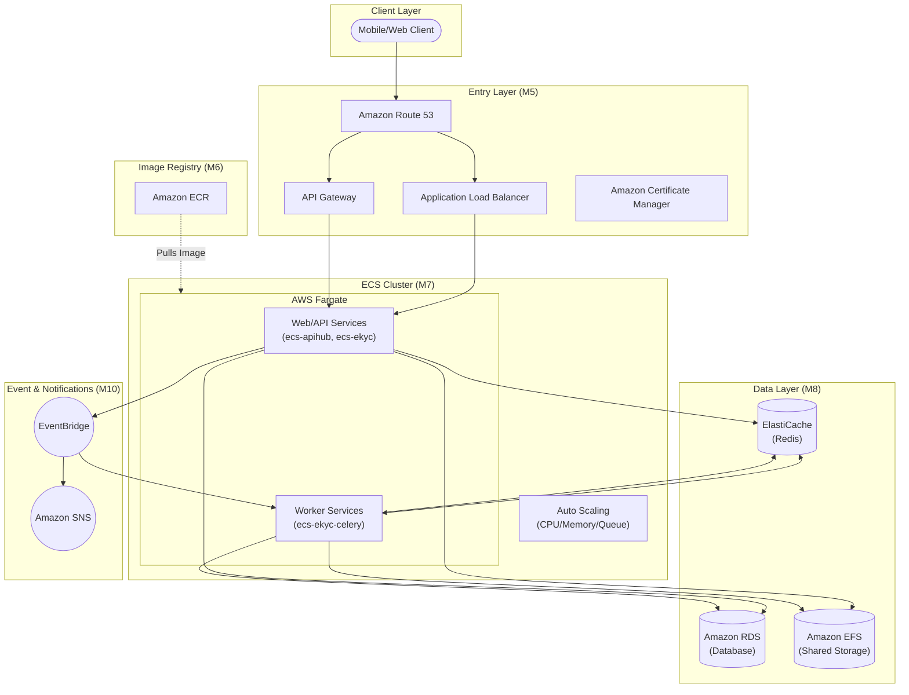

**AWS DevOps Learning Roadmap**

*Từ Mobile Software Engineer → DevOps Engineer cho hệ thống ECS/Fargate, ECR, ALB, RDS, Redis, EFS, EventBridge, SNS, CloudFormation*

Mục tiêu: học theo module, có link học chi tiết, có bài thực hành và checklist vận hành production.

*Sơ đồ tham chiếu: hệ thống AWS dùng ECR → ECS services → data layer → autoscaling/event/notification.*

# **1\. Cách dùng tài liệu này**

* Đọc theo thứ tự module. Mỗi module có mục tiêu, kiến thức cần học, bài thực hành và link tài liệu chi tiết.  
* Ưu tiên làm hands-on sau khi đọc. DevOps là kỹ năng vận hành, không nên chỉ học lý thuyết.  
* Với hệ thống giống sơ đồ, trọng tâm là AWS networking, Docker/ECR, ECS/Fargate, ALB/API Gateway, RDS/Redis/EFS, CloudFormation, CI/CD, observability và security.  
* Khi thực hành trên tài khoản AWS thật, dùng môi trường sandbox/dev trước. Tránh thao tác trực tiếp production khi chưa hiểu rõ tác động.

| Cảnh báo quan trọng cho Network/Production Các thao tác như đổi Security Group, Route Table, NAT Gateway, ALB listener, DNS record, certificate hoặc subnet association có thể làm rớt traffic, mất SSH/SSM access, làm API downtime hoặc khiến client không truy cập được hệ thống. Luôn kiểm tra change set, backup config hiện tại và có rollback plan trước khi làm trên production. |
| :---- |

# **2\. Mapping từ sơ đồ sang skill cần học**

| Thứ tự build | Phần trong sơ đồ | AWS service | Bạn cần học gì | Module |
| :---- | :---- | :---- | :---- | :---- |
| 1 | Image Registry | Amazon ECR | Docker image, tagging, push/pull, lifecycle policy, permission | M2, M6 |
| 2 | Core Network & Entry | VPC, ACM, ALB, API Gateway, Route 53 | TLS, DNS, listener, target group, path/host routing, API route | M4, M5 |
| 3 | ECS Cluster & Services | Amazon ECS/Fargate | cluster, task definition, service, logs, health check, deployment, exec | M7 |
| 4 | Data Layer | RDS, ElastiCache Redis, EFS | backup/restore, connection, private networking, mount, performance | M8 |
| 5 | Auto Scaling | ECS Service Auto Scaling, Application Auto Scaling | CPU/memory/request/queue scaling, cooldown, min/max tasks | M9 |
| 6 | Event/Notifications | EventBridge, SNS | schedule/event rules, targets, topics, subscriptions, alerting | M10 |
| 7 | Independent Services | EC2, EFS transfer, Samba | SSH/SSM, AMI, EBS, hardening, backup, patching | M4, M14 |
| All | IaC / Build Order | CloudFormation | template, stack, nested stack, outputs, rollback, change set | M11 |
| All | Deploy & Operate | CI/CD, CloudWatch, CloudTrail, Secrets, KMS | pipeline, logs, alarms, secrets, encryption, audit | M12, M13, M14 |

# **3\. Roadmap đề xuất**

| No | Module | Mục tiêu | Deliverable | Độ ưu tiên |
| :---- | :---- | :---- | :---- | :---- |
| 1 | M0 Linux/Git | Tự tin thao tác terminal, logs, services, process, Git branch | Cheatsheet lệnh \+ debug một service local | Bắt buộc |
| 2 | M1 Network/Web | Hiểu HTTP, DNS, TLS, port, subnet, route | Vẽ flow request từ mobile app đến API | Bắt buộc |
| 3 | M2 Docker | Dockerize app, hiểu image/container/volume/network | Dockerfile \+ docker compose chạy local | Bắt buộc |
| 4 | M3 IAM/AWS CLI | Cấu hình AWS CLI, IAM role/policy, least privilege | Tạo IAM role/policy lab an toàn | Bắt buộc |
| 5 | M4 VPC/EC2 | Dựng VPC public/private, NAT, SG, EC2 | EC2 private access qua SSM/SSH \+ network diagram | Bắt buộc |
| 6 | M5 Entry layer | ALB, ACM, Route53, API Gateway | HTTPS domain → ALB → health check OK | Bắt buộc |
| 7 | M6-M7 ECR/ECS | Push image ECR, deploy ECS Fargate service | ECS service sau ALB, rolling deploy OK | Bắt buộc |
| 8 | M8 Data layer | RDS, Redis, EFS private access | App ECS kết nối RDS/Redis, mount EFS | Bắt buộc |
| 9 | M9 Scaling | ECS Service Auto Scaling | Policy scale theo CPU/memory/request | Quan trọng |
| 10 | M10 Event/SNS | Scheduled jobs, event rules, notification | EventBridge schedule → SNS/email hoặc ECS task | Quan trọng |
| 11 | M11 CloudFormation | Dựng IaC theo build order | Nested stack mini architecture | Bắt buộc |
| 12 | M12 CI/CD | Build image, push ECR, update ECS | GitHub Actions/CodePipeline deploy tự động | Bắt buộc |
| 13 | M13 Observability | Logs, metrics, alarms, dashboards, audit | CloudWatch dashboard \+ alarms \+ CloudTrail check | Bắt buộc |
| 14 | M14 Security/DR/Cost | Hardening, backup, incident response, cost | Runbook rollback \+ backup restore drill | Bắt buộc |

# **4\. Chi tiết từng module học**

## **M0. Linux, Terminal, Git và tư duy vận hành server**

**Mục tiêu:** Bạn cần thao tác được với server, đọc log, hiểu process/service, permission, SSH/SSM và dùng Git tốt trước khi đi sâu vào AWS.

Cần học:

* Linux file system, permission, users/groups, process, port, disk, memory.  
* systemd/service, journalctl, log files, cron, environment variables.  
* SSH key, known\_hosts, authorized\_keys, basic hardening.  
* Git branch, merge/rebase, tag, rollback commit, release branch.

Bài thực hành nên làm:

1. Cài Ubuntu VM hoặc dùng EC2 nhỏ; luyện các lệnh: ls, cd, grep, find, tail, systemctl, journalctl, ss/netstat, df, du, top/htop.  
2. Tạo một service systemd chạy Node/Rails/Python app demo và đọc log khi service lỗi.
3. Tạo Git repo demo, build một flow release: feature branch → PR → merge → tag.

Link học chi tiết:

* [Ubuntu command line for beginners](https://documentation.ubuntu.com/desktop/en/latest/tutorial/the-linux-command-line-for-beginners/)  
* [Ubuntu Server documentation](https://ubuntu.com/server/docs/)  
* [Pro Git book](https://git-scm.com/book/en/v2)

## **M1. Networking, HTTP, DNS và TLS**

**Mục tiêu:** AWS DevOps gặp lỗi nhiều nhất ở network. Bạn cần hiểu đường đi request, DNS resolve, TLS certificate, firewall rule, timeout và health check.

Cần học:

* HTTP request/response, status code, header, timeout, CORS basics.  
* DNS A/CNAME/alias record, propagation, TTL, split-horizon DNS concept.  
* TLS/HTTPS, certificate, chain, domain validation.  
* Port, protocol, CIDR, subnet, public/private network, routing.

Bài thực hành nên làm:

4. Vẽ flow: Mobile app → DNS → ALB/API Gateway → ECS → RDS/Redis/EFS.  
5. Dùng curl kiểm tra status/header/timeout; dùng dig/nslookup kiểm tra DNS.  
6. Dùng openssl s\_client hoặc browser devtools kiểm tra certificate.

| Lưu ý production Khi thay đổi DNS, certificate, ALB listener hoặc route, người dùng thật có thể bị lỗi truy cập. Nên giảm TTL trước migration DNS, test bằng domain phụ và có rollback record. |
| :---- |

Link học chi tiết:

* [MDN: Overview of HTTP](https://developer.mozilla.org/en-US/docs/Web/HTTP/Guides/Overview)  
* [Cloudflare: What is DNS?](https://www.cloudflare.com/learning/dns/what-is-dns/)  
* [MDN: Transport Layer Security](https://developer.mozilla.org/en-US/docs/Web/Security/Defenses/Transport_Layer_Security)  
* [AWS VPC overview](https://docs.aws.amazon.com/vpc/latest/userguide/what-is-amazon-vpc.html)

## **M2. Docker và containerization**

**Mục tiêu:** ECS chạy container, nên Docker là nền tảng bắt buộc. Bạn cần build được image sạch, nhỏ, có health check và chạy được giống nhau ở local/CI/production.

Cần học:

* Dockerfile, image layer, multi-stage build, tag/version, .dockerignore.  
* Container runtime, env vars, ports, volume, network, stdout/stderr logs.  
* Docker Compose cho local dev gồm app \+ postgres \+ redis.  
* Image security basics: non-root user, pin base image, scan vulnerabilities.

Bài thực hành nên làm:

7. Dockerize một API demo.  
8. Tạo docker-compose có web \+ postgres \+ redis.  
9. Tối ưu image bằng multi-stage build, so sánh size trước/sau.

Link học chi tiết:

* [Docker docs: Get started](https://docs.docker.com/get-started/)  
* [Docker docs: Writing a Dockerfile](https://docs.docker.com/get-started/docker-concepts/building-images/writing-a-dockerfile/)

## **M3. AWS account, AWS CLI và IAM**

**Mục tiêu:** Trước khi deploy, bạn phải hiểu identity, permission và thao tác bằng CLI. IAM sai có thể gây lộ dữ liệu hoặc làm pipeline/deploy lỗi.

Cần học:

* AWS account baseline, MFA, root user best practice.  
* AWS CLI install/config/profile/region/output.  
* IAM user, group, role, policy, trust policy, permission policy.  
* Least privilege, temporary credentials, ECS task role vs execution role.

Bài thực hành nên làm:

10. Cài AWS CLI, tạo profile dev, chạy aws sts get-caller-identity.  
11. Tạo IAM policy read-only cho một service, test access denied khi gọi ngoài quyền.  
12. Phân biệt ECS execution role dùng pull image/logs và task role dùng app access AWS services.

| Lưu ý production Không dùng root access key. Không commit access key vào Git. Nếu lộ key phải rotate ngay và kiểm tra CloudTrail. |
| :---- |

Link học chi tiết:

* [AWS CLI getting started](https://docs.aws.amazon.com/cli/latest/userguide/cli-chap-getting-started.html)  
* [AWS CLI install/update](https://docs.aws.amazon.com/cli/latest/userguide/getting-started-install.html)  
* [IAM introduction](https://docs.aws.amazon.com/IAM/latest/UserGuide/introduction.html)  
* [IAM least privilege](https://docs.aws.amazon.com/IAM/latest/UserGuide/getting-started-reduce-permissions.html)  
* [IAM roles](https://docs.aws.amazon.com/IAM/latest/UserGuide/id_roles.html)

## **M4. VPC, Subnet, Security Group, NAT Gateway và EC2**

**Mục tiêu:** Đây là xương sống của hệ thống. ECS, RDS, Redis, EFS đều chạy trong VPC/private subnet, nên phải hiểu route và firewall.

Cần học:

* VPC CIDR, public/private subnet, Availability Zone.  
* Internet Gateway, NAT Gateway, route table, route propagation.  
* Security Group stateful firewall, NACL concept.  
* EC2, SSH/SSM, key pair, EBS, AMI, Elastic IP, CloudWatch Agent.  
* Private access pattern: ECS → RDS/Redis/EFS without public exposure.

Bài thực hành nên làm:

13. Dựng VPC 2 AZ: public subnet cho ALB/NAT, private subnet cho ECS/RDS.  
14. Launch EC2 test, kiểm tra outbound internet qua NAT từ private subnet.  
15. Tạo SG: ALB chỉ 80/443 public, ECS chỉ nhận từ ALB SG, RDS chỉ nhận từ ECS SG.

| Lưu ý production Thay đổi route table, NAT Gateway, Security Group hoặc subnet association có thể làm mất internet outbound của private services, mất SSH/SSM, hoặc làm app không kết nối được database/cache. |
| :---- |

Link học chi tiết:

* [AWS VPC: What is Amazon VPC?](https://docs.aws.amazon.com/vpc/latest/userguide/what-is-amazon-vpc.html)  
* [AWS VPC: Plan your VPC](https://docs.aws.amazon.com/vpc/latest/userguide/vpc-getting-started.html)  
* [AWS VPC: Route tables](https://docs.aws.amazon.com/vpc/latest/userguide/VPC_Route_Tables.html)  
* [AWS VPC: Security groups](https://docs.aws.amazon.com/vpc/latest/userguide/vpc-security-groups.html)  
* [AWS VPC: NAT gateways](https://docs.aws.amazon.com/vpc/latest/userguide/vpc-nat-gateway.html)  
* [EC2 getting started](https://docs.aws.amazon.com/AWSEC2/latest/UserGuide/EC2_GetStarted.html)

## **M5. Entry layer: ALB, ACM, Route 53 và API Gateway**

**Mục tiêu:** Sơ đồ có ACM, ALB và API Gateway. Bạn cần biết cách user traffic vào hệ thống, TLS terminate ở đâu và route traffic đến ECS service nào.

Cần học:

* ACM public certificate, DNS validation, renewal.  
* ALB listener, target group, health check, path/host-based routing.  
* Route 53 hosted zone, A/AAAA Alias, CNAME, DNS TTL.  
* API Gateway REST/HTTP API, custom domain, integration, throttling, logging.

Bài thực hành nên làm:

16. Request ACM certificate bằng DNS validation.  
17. Tạo ALB HTTPS listener và target group cho ECS/EC2 demo.  
18. Tạo Route 53 alias record trỏ domain/subdomain vào ALB.  
19. Tạo API Gateway route /health proxy đến backend demo.

| Lưu ý production Sai health check path hoặc target group port có thể làm ECS service liên tục unhealthy. Sai DNS/certificate có thể làm HTTPS lỗi hoặc client app không gọi được API. |
| :---- |

Link học chi tiết:

* [Application Load Balancer introduction](https://docs.aws.amazon.com/elasticloadbalancing/latest/application/introduction.html)  
* [Create an Application Load Balancer](https://docs.aws.amazon.com/elasticloadbalancing/latest/application/create-application-load-balancer.html)  
* [ACM getting started](https://docs.aws.amazon.com/acm/latest/userguide/gs.html)  
* [ACM DNS validation](https://docs.aws.amazon.com/acm/latest/userguide/dns-validation.html)  
* [API Gateway developer guide](https://docs.aws.amazon.com/apigateway/latest/developerguide/welcome.html)  
* [Route 53 getting started](https://docs.aws.amazon.com/Route53/latest/DeveloperGuide/getting-started.html)

## **M6. Amazon ECR \- Image Registry**

**Mục tiêu:** ECR là nơi lưu Docker images cho ECS pull khi deploy. Đây là bước đầu trong build order của sơ đồ.

Cần học:

* Repository, image tag, digest, immutable tag strategy.  
* Login ECR bằng AWS CLI, docker tag/push/pull.  
* Lifecycle policy để xóa image cũ.  
* Repository policy, IAM permission, image scanning.

Bài thực hành nên làm:

20. Build image local và push lên ECR.  
21. Tạo tag theo commit SHA và latest.  
22. Cấu hình lifecycle policy giữ 20 bản gần nhất hoặc giữ theo môi trường.

Link học chi tiết:

* [Amazon ECR getting started](https://docs.aws.amazon.com/AmazonECR/latest/userguide/example_ecr_GettingStarted_078_section.html)  
* [Amazon ECR overview / getting started page](https://aws.amazon.com/ecr/getting-started/)

## **M7. Amazon ECS/Fargate \- Cluster, Task Definition, Service**

**Mục tiêu:** Đây là core runtime trong sơ đồ. Bạn cần triển khai nhiều service kiểu web/API và worker như ecs-ekyc, ecs-ekyc-celery, ecs-apihub-celery.

Cần học:

* Cluster, capacity provider, Fargate vs EC2 launch type.  
* Task Definition: container, CPU/memory, port mapping, env, secrets, logs, health check.  
* ECS Service: desired count, deployment configuration, target group, service discovery.  
* Web service vs worker service; rolling deployment; ECS Exec; task restart/debug.  
* Task role vs execution role; CloudWatch logs.

Bài thực hành nên làm:

23. Deploy một web service Fargate sau ALB.  
24. Deploy một worker service không public endpoint.  
25. Debug task lỗi bằng stopped reason, CloudWatch logs, ECS Exec.
26. Thực hành update image tag và rollback về revision trước.

| Lưu ý production Không tăng desired count hoặc CPU/memory bừa bãi trên production vì có thể tăng cost nhanh. Khi update task definition cần kiểm tra env/secrets/port/log group trước khi deploy. |
| :---- |

Link học chi tiết:

* [What is Amazon ECS?](https://docs.aws.amazon.com/AmazonECS/latest/developerguide/Welcome.html)  
* [ECS getting started](https://docs.aws.amazon.com/AmazonECS/latest/developerguide/getting-started.html)  
* [AWS Fargate for Amazon ECS](https://docs.aws.amazon.com/AmazonECS/latest/developerguide/AWS_Fargate.html)  
* [Getting started with Amazon ECS page](https://aws.amazon.com/ecs/getting-started/)

## **M8. Data layer: RDS, ElastiCache Redis và EFS**

**Mục tiêu:** Sơ đồ có RDS retain template, Redis, EFS shared storage. DevOps cần bảo vệ data, backup, private access và performance.

Cần học:

* RDS instance, subnet group, parameter group, backup, snapshot, restore, Multi-AZ, connection pool.  
* Redis/ElastiCache: cache/session/queue broker, memory, eviction, security group, persistence/backup.  
* EFS: file system, mount target, access point, NFS port 2049, permission, backup.  
* Private connectivity from ECS tasks to data services.

Bài thực hành nên làm:

27. Tạo RDS dev, connect từ ECS/EC2 private network, thử backup/restore snapshot.  
28. Tạo Redis dev, test app cache/session/queue connection.  
29. Mount EFS vào ECS task hoặc EC2, test read/write permission.  
30. Tạo checklist backup retention và restore drill.

| Lưu ý production Không public RDS/Redis ra internet. Trước khi đổi SG, parameter group hoặc maintenance window cần kiểm tra ảnh hưởng connection và downtime. Luôn test restore, không chỉ tạo backup. |
| :---- |

Link học chi tiết:

* [RDS getting started](https://docs.aws.amazon.com/AmazonRDS/latest/UserGuide/CHAP_GettingStarted.html)  
* [What is Amazon RDS?](https://docs.aws.amazon.com/AmazonRDS/latest/UserGuide/Welcome.html)  
* [ElastiCache getting started](https://docs.aws.amazon.com/AmazonElastiCache/latest/dg/GettingStarted.html)  
* [EFS getting started](https://docs.aws.amazon.com/efs/latest/ug/getting-started.html)  
* [What is Amazon EFS?](https://docs.aws.amazon.com/efs/latest/ug/whatisefs.html)

## **M9. Auto Scaling cho ECS services**

**Mục tiêu:** Auto Scaling giúp hệ thống chịu tải tốt hơn nhưng phải hiểu metric và cooldown để tránh scale sai hoặc cost spike.

Cần học:

* ECS desired count, min/max task.  
* Target tracking, step scaling, scheduled scaling.  
* Metric: CPU, memory, ALB request count, custom queue length.  
* Cooldown, scale-in protection, worker scaling theo queue depth.

Bài thực hành nên làm:

31. Tạo ECS service auto scaling theo CPU 60-70%.  
32. Tạo alarm/metric cho memory và request count.  
33. Test load nhẹ để quan sát scale out/scale in.  
34. Thiết kế worker scaling theo queue length trên paper nếu chưa có custom metric.

| Lưu ý production Scale policy sai có thể tạo quá nhiều task gây tăng chi phí, hoặc scale-in quá nhanh làm mất capacity. Với worker, cần xử lý graceful shutdown để không mất job. |
| :---- |

Link học chi tiết:

* [ECS Service Auto Scaling](https://docs.aws.amazon.com/AmazonECS/latest/developerguide/service-auto-scaling.html)  
* [Application Auto Scaling overview](https://docs.aws.amazon.com/autoscaling/application/userguide/what-is-application-auto-scaling.html)

## **M10. EventBridge và SNS**

**Mục tiêu:** Sơ đồ dùng EventBridge cho event/domain call và SNS cho notifications. Đây là phần automation và alerting quan trọng.

Cần học:

* EventBridge rule, event bus, schedule, target, input transformer.  
* SNS topic, subscription, fan-out, email/webhook/Lambda/SQS target.  
* Alert routing: CloudWatch Alarm → SNS, EventBridge event → SNS.  
* Scheduled ECS task / periodic jobs.

Bài thực hành nên làm:

35. Tạo EventBridge schedule chạy mỗi ngày và gửi SNS email.  
36. Tạo rule bắt một event AWS đơn giản và publish SNS.  
37. Thiết kế flow: app event → EventBridge → downstream worker.

Link học chi tiết:

* [What is EventBridge?](https://docs.aws.amazon.com/eventbridge/latest/userguide/eb-what-is.html)  
* [EventBridge tutorials](https://docs.aws.amazon.com/eventbridge/latest/userguide/eb-tutorial.html)  
* [SNS getting started](https://docs.aws.amazon.com/sns/latest/dg/sns-getting-started.html)  
* [What is Amazon SNS?](https://docs.aws.amazon.com/sns/latest/dg/welcome.html)

## **M11. CloudFormation \- Infrastructure as Code**

**Mục tiêu:** Sơ đồ build bằng CloudFormation. Bạn cần dựng được stack theo đúng thứ tự, dùng parameter/output/import và biết rollback.

Cần học:

* Template YAML, Resources, Parameters, Mappings, Conditions, Outputs.  
* Stack create/update/delete, change set, drift detection.  
* Nested stacks: network, data, ECS services, autoscaling, event.  
* Export/ImportValue, DependsOn, retain policy, deletion policy.  
* Rollback debugging và safe changes.

Bài thực hành nên làm:

38. Viết template tạo ECR repository.  
39. Viết network stack tạo VPC/subnets/SG output.  
40. Viết ECS service stack nhận ImageUri/ClusterName/TargetGroupArn.  
41. Tạo nested root stack mô phỏng build order của sơ đồ.

| Lưu ý production CloudFormation update production có thể replace resource nếu property thay đổi. Luôn xem Change Set trước khi execute, đặc biệt với RDS/EFS/ALB/VPC resources. Dùng DeletionPolicy Retain cho data layer khi phù hợp. |
| :---- |

Link học chi tiết:

* [CloudFormation getting started](https://docs.aws.amazon.com/AWSCloudFormation/latest/UserGuide/GettingStarted.html)  
* [What is CloudFormation?](https://docs.aws.amazon.com/AWSCloudFormation/latest/UserGuide/Welcome.html)  
* [Template sections/anatomy](https://docs.aws.amazon.com/AWSCloudFormation/latest/UserGuide/template-anatomy.html)  
* [Nested stacks](https://docs.aws.amazon.com/AWSCloudFormation/latest/UserGuide/using-cfn-nested-stacks.html)

## **M12. CI/CD: Build, push ECR và deploy ECS**

**Mục tiêu:** DevOps role cần tự động hóa release: test code, build image, push ECR, update ECS service, notify team và rollback khi lỗi.

Cần học:

* Pipeline stages: source, test, build, scan, push ECR, deploy ECS, migration, notify.  
* GitHub Actions vs AWS CodePipeline/CodeBuild/CodeDeploy.  
* Environment secrets, OIDC/IAM role, no long-lived AWS key if possible.  
* Blue/green vs rolling deployment, manual approval for production.

Bài thực hành nên làm:

42. Tạo GitHub Actions build image và push ECR.  
43. Update ECS task definition image tag rồi deploy service.  
44. Tạo CodePipeline ECS standard deployment hoặc blue/green demo.  
45. Thêm step notify Slack/SNS khi deploy success/failure.

| Lưu ý production Pipeline production cần manual approval hoặc canary/blue-green cho service quan trọng. Không để secret dạng plain text trong repo hoặc build logs. |
| :---- |

Link học chi tiết:

* [GitHub Actions: Deploying to Amazon ECS](https://docs.github.com/actions/guides/deploying-to-amazon-elastic-container-service)  
* [AWS action: ECS deploy task definition](https://github.com/aws-actions/amazon-ecs-deploy-task-definition)  
* [What is CodePipeline?](https://docs.aws.amazon.com/codepipeline/latest/userguide/welcome.html)  
* [CodePipeline ECS standard deployment tutorial](https://docs.aws.amazon.com/codepipeline/latest/userguide/ecs-cd-pipeline.html)  
* [CodePipeline ECR \+ ECS blue/green tutorial](https://docs.aws.amazon.com/codepipeline/latest/userguide/tutorials-ecs-ecr-codedeploy.html)  
* [CodeBuild getting started](https://docs.aws.amazon.com/codebuild/latest/userguide/getting-started-overview.html)

## **M13. Observability: CloudWatch Logs/Metrics/Alarms, CloudTrail, dashboards**

**Mục tiêu:** Deploy được chưa đủ; phải biết phát hiện lỗi, đọc log, xem metric, đặt alarm, audit ai đã thay đổi gì.

Cần học:

* CloudWatch Logs: log group, retention, search/filter, Insights query.  
* CloudWatch Metrics/Alarms/Dashboard: ECS, ALB, RDS, Redis, NAT, API Gateway.  
* CloudTrail: event history, trail, who changed security group/route/IAM.  
* Runbook incident: detect, triage, rollback, postmortem.

Bài thực hành nên làm:

46. Tạo dashboard gồm ALB 5xx, ECS CPU/memory, task count, RDS connections, Redis memory.  
47. Dùng endpoint `/test-error` của app demo để tạo HTTP 500 data mà không làm task crash.
48. Tạo alarms: ALB 5xx \> threshold, ECS task stopped, RDS free storage low.
49. Tìm trong CloudTrail sự kiện update security group hoặc delete resource.
50. Viết runbook 1 trang cho lỗi 502/503 từ ALB.

Link học chi tiết:

* [What is CloudWatch?](https://docs.aws.amazon.com/AmazonCloudWatch/latest/monitoring/WhatIsCloudWatch.html)  
* [CloudWatch getting started](https://aws.amazon.com/cloudwatch/getting-started/)  
* [What is CloudTrail?](https://docs.aws.amazon.com/awscloudtrail/latest/userguide/cloudtrail-user-guide.html)  
* [CloudTrail tutorials](https://docs.aws.amazon.com/awscloudtrail/latest/userguide/cloudtrail-tutorial.html)

## **M14. Security, Secrets, Encryption, Backup/DR và Cost optimization**

**Mục tiêu:** Đây là phần để làm DevOps production thật: giảm risk, bảo vệ secret/data, có backup/restore và kiểm soát chi phí.

Cần học:

* Secrets Manager/SSM Parameter Store for DB password/API key.  
* KMS key, encryption at rest/in transit, key policy basics.  
* Security baseline: least privilege, private DB/Redis, WAF basics, image scanning, no public SSH unless controlled.  
* Backup/DR: RDS snapshot/PITR, EFS backup, AMI/EBS snapshot, restore drill.  
* Cost: ECS task sizing, NAT Gateway cost, RDS right sizing, log retention, idle resources.

Bài thực hành nên làm:

51. Move hardcoded database password to Secrets Manager.
52. Use KMS encryption for RDS/EFS/secrets/logs where applicable.
53. Create backup policy and run a restore test.
54. Create monthly cost checklist: NAT, RDS, ECS, EBS snapshots, CloudWatch logs.

| Lưu ý production Xóa resource nhầm, rotate secret sai, hoặc đổi KMS key policy sai có thể làm app mất quyền decrypt/connect. Luôn test ở dev và chuẩn bị rollback trước khi làm production. |
| :---- |

Link học chi tiết:

* [Secrets Manager introduction](https://docs.aws.amazon.com/secretsmanager/latest/userguide/intro.html)  
* [AWS Secrets Manager page](https://aws.amazon.com/secrets-manager/)  
* [AWS KMS overview](https://docs.aws.amazon.com/kms/latest/developerguide/overview.html)  
* [AWS Well-Architected Framework](https://docs.aws.amazon.com/wellarchitected/latest/framework/welcome.html)

## **M15. Capstone project \- dựng mini architecture giống sơ đồ**

**Mục tiêu:** Module cuối dùng để kiểm tra bạn đã sẵn sàng làm DevOps cho hệ thống tương tự chưa.

Cần học:

* Thiết kế architecture nhỏ: one web API, one worker, RDS, Redis, optional EFS.  
* IaC bằng CloudFormation, CI/CD deploy image ECR → ECS.  
* Monitoring, alerting, backup/restore, security checklist.  
* Viết README vận hành và runbook incident.

Bài thực hành nên làm:

55. Dựng VPC 2 AZ \+ ALB \+ ECS Fargate web service.
56. Build/push image lên ECR bằng pipeline.
57. ECS service connect RDS/Redis, worker service xử lý job demo.
58. CloudFormation root stack \+ nested stacks theo build order.
59. CloudWatch dashboard \+ 3 alarms \+ SNS notification.
60. Restore drill: backup RDS → restore dev DB → verify app connect.

Link học chi tiết:

* [AWS Skill Builder digital training](https://aws.amazon.com/training/digital/)  
* [Amazon ECS workshop / getting started](https://aws.amazon.com/ecs/getting-started/)  
* [AWS Well-Architected Framework](https://docs.aws.amazon.com/wellarchitected/latest/framework/welcome.html)

# **5\. Checklist năng lực sau khi học**

| Kỹ năng | Bạn cần tự làm được | Dấu hiệu đạt | Ghi chú production |
| :---- | :---- | :---- | :---- |
| Networking | Vẽ và giải thích flow client → DNS → ALB/API Gateway → ECS → RDS/Redis/EFS | Debug được lỗi timeout/502/503/SG/DNS cơ bản | Luôn có rollback plan khi đổi route/DNS/SG |
| Docker/ECR | Build/tag/push image, hiểu image digest và tag strategy | Pipeline push image ổn định, không leak secret | Pin base image, scan vulnerabilities |
| ECS/Fargate | Deploy web/worker service, update task definition, xem logs, exec vào task | Rollback revision khi deploy lỗi | Kiểm tra health check/capacity trước deploy |
| Data layer | Connect RDS/Redis/EFS private, backup/restore | Restore test thành công | Không public DB/cache |
| IaC | CloudFormation stack/nested stack/change set | Dựng được mini architecture bằng IaC | Xem replacement risk trước execute |
| CI/CD | Pipeline test/build/push/deploy/notify | Deploy repeatable, có rollback | Approval cho prod, secret qua IAM/Secrets |
| Observability | Dashboard \+ alarms \+ log query \+ CloudTrail audit | Tìm được nguyên nhân incident cơ bản | Retention log/cost được kiểm soát |
| Security/DR | Least privilege, secret rotation, encryption, backup plan | Có runbook và restore drill | Không thay đổi key/secret production nếu chưa test |

# **6\. Gợi ý chứng chỉ nếu muốn có lộ trình rõ hơn**

Không bắt buộc phải thi chứng chỉ, nhưng dùng syllabus của chứng chỉ để học có hệ thống. Với mục tiêu DevOps cho hệ thống ECS/Fargate, lộ trình hợp lý là:

* AWS Certified Cloud Practitioner: nếu bạn mới với cloud và muốn nắm thuật ngữ/nền tảng.  
* AWS Certified Solutions Architect – Associate: tốt để hiểu thiết kế VPC, compute, database, security, reliability, cost.  
* AWS Certified SysOps Administrator – Associate: sát với vận hành, monitoring, networking, security, backup và cost.  
* AWS Certified DevOps Engineer – Professional: sau khi đã có kinh nghiệm thực tế CI/CD, IaC, monitoring, automation.  
* [AWS Certified Cloud Practitioner](https://aws.amazon.com/certification/certified-cloud-practitioner/)  
* [AWS Certified Solutions Architect – Associate](https://aws.amazon.com/certification/certified-solutions-architect-associate/)  
* [AWS Certified SysOps Administrator – Associate](https://aws.amazon.com/certification/certified-sysops-admin-associate/)  
* [AWS Certified DevOps Engineer – Professional](https://aws.amazon.com/certification/certified-devops-engineer-professional/)

# **7\. Appendix \- danh sách link học nhanh theo nhóm**

## **Foundation**

* [Ubuntu CLI](https://documentation.ubuntu.com/desktop/en/latest/tutorial/the-linux-command-line-for-beginners/)  
* [Ubuntu Server Docs](https://ubuntu.com/server/docs/)  
* [Pro Git](https://git-scm.com/book/en/v2)  
* [MDN HTTP](https://developer.mozilla.org/en-US/docs/Web/HTTP/Guides/Overview)  
* [Cloudflare DNS](https://www.cloudflare.com/learning/dns/what-is-dns/)  
* [MDN TLS](https://developer.mozilla.org/en-US/docs/Web/Security/Defenses/Transport_Layer_Security)

## **Container/ECS**

* [Docker Get Started](https://docs.docker.com/get-started/)  
* [Dockerfile Guide](https://docs.docker.com/get-started/docker-concepts/building-images/writing-a-dockerfile/)  
* [ECR Getting Started](https://docs.aws.amazon.com/AmazonECR/latest/userguide/example_ecr_GettingStarted_078_section.html)  
* [ECS Developer Guide](https://docs.aws.amazon.com/AmazonECS/latest/developerguide/Welcome.html)  
* [ECS Getting Started](https://docs.aws.amazon.com/AmazonECS/latest/developerguide/getting-started.html)  
* [AWS Fargate](https://docs.aws.amazon.com/AmazonECS/latest/developerguide/AWS_Fargate.html)

## **Network/Entry**

* [VPC Overview](https://docs.aws.amazon.com/vpc/latest/userguide/what-is-amazon-vpc.html)  
* [VPC Planning](https://docs.aws.amazon.com/vpc/latest/userguide/vpc-getting-started.html)  
* [Route Tables](https://docs.aws.amazon.com/vpc/latest/userguide/VPC_Route_Tables.html)  
* [Security Groups](https://docs.aws.amazon.com/vpc/latest/userguide/vpc-security-groups.html)  
* [NAT Gateway](https://docs.aws.amazon.com/vpc/latest/userguide/vpc-nat-gateway.html)  
* [ALB Intro](https://docs.aws.amazon.com/elasticloadbalancing/latest/application/introduction.html)  
* [ACM Getting Started](https://docs.aws.amazon.com/acm/latest/userguide/gs.html)  
* [API Gateway](https://docs.aws.amazon.com/apigateway/latest/developerguide/welcome.html)  
* [Route 53](https://docs.aws.amazon.com/Route53/latest/DeveloperGuide/getting-started.html)

## **Data/Scaling/Event**

* [RDS Getting Started](https://docs.aws.amazon.com/AmazonRDS/latest/UserGuide/CHAP_GettingStarted.html)  
* [ElastiCache Getting Started](https://docs.aws.amazon.com/AmazonElastiCache/latest/dg/GettingStarted.html)  
* [EFS Getting Started](https://docs.aws.amazon.com/efs/latest/ug/getting-started.html)  
* [ECS Auto Scaling](https://docs.aws.amazon.com/AmazonECS/latest/developerguide/service-auto-scaling.html)  
* [EventBridge](https://docs.aws.amazon.com/eventbridge/latest/userguide/eb-what-is.html)  
* [SNS Getting Started](https://docs.aws.amazon.com/sns/latest/dg/sns-getting-started.html)

## **IaC/CI/CD/Operations**

* [CloudFormation Getting Started](https://docs.aws.amazon.com/AWSCloudFormation/latest/UserGuide/GettingStarted.html)  
* [Template Anatomy](https://docs.aws.amazon.com/AWSCloudFormation/latest/UserGuide/template-anatomy.html)  
* [Nested Stacks](https://docs.aws.amazon.com/AWSCloudFormation/latest/UserGuide/using-cfn-nested-stacks.html)  
* [GitHub Actions to ECS](https://docs.github.com/actions/guides/deploying-to-amazon-elastic-container-service)  
* [CodePipeline](https://docs.aws.amazon.com/codepipeline/latest/userguide/welcome.html)  
* [CloudWatch](https://docs.aws.amazon.com/AmazonCloudWatch/latest/monitoring/WhatIsCloudWatch.html)  
* [CloudTrail](https://docs.aws.amazon.com/awscloudtrail/latest/userguide/cloudtrail-user-guide.html)  
* [Secrets Manager](https://docs.aws.amazon.com/secretsmanager/latest/userguide/intro.html)  
* [KMS](https://docs.aws.amazon.com/kms/latest/developerguide/overview.html)  
* [Well-Architected Framework](https://docs.aws.amazon.com/wellarchitected/latest/framework/welcome.html)

# **8\. Output portfolio nên có sau khi hoàn thành**

* GitHub repo chứa CloudFormation templates: network, ecr, ecs, data, autoscaling, event, root stack.  
* GitHub Actions hoặc CodePipeline demo build image → push ECR → deploy ECS.  
* Architecture diagram phiên bản mini có ghi rõ public/private subnet, SG rules và data access.  
* Runbook incidents: ALB 502/503, ECS task crash, RDS connection exhaustion, Redis memory full, EFS permission denied.  
* Backup/restore checklist và kết quả một lần restore drill.  
* Security checklist: IAM least privilege, no public DB/Redis, secrets managed, encryption enabled, CloudTrail/CloudWatch enabled.

